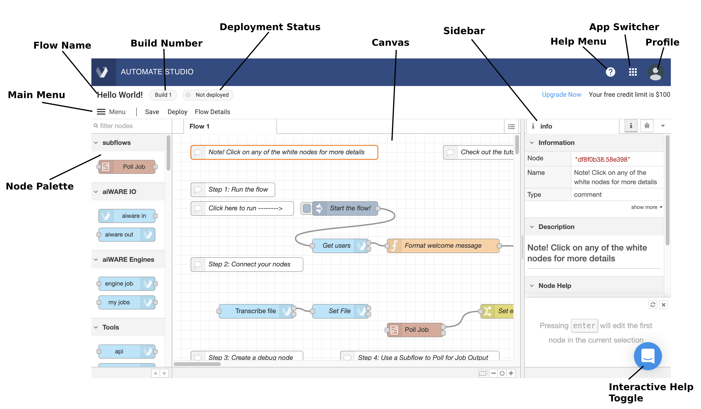
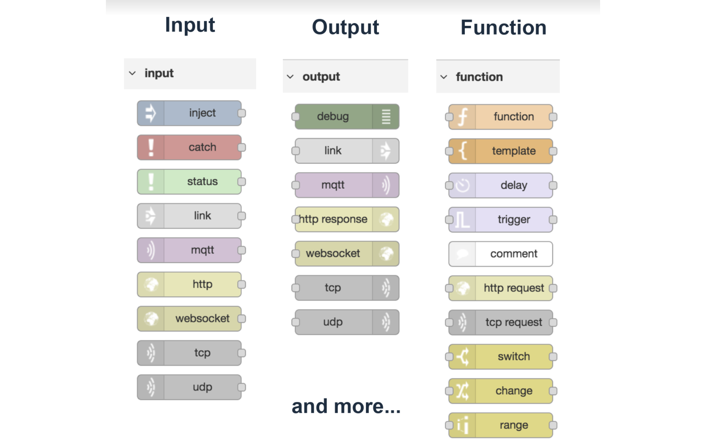
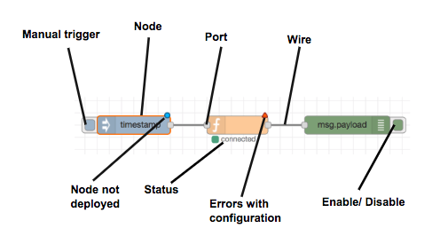
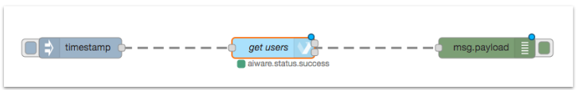
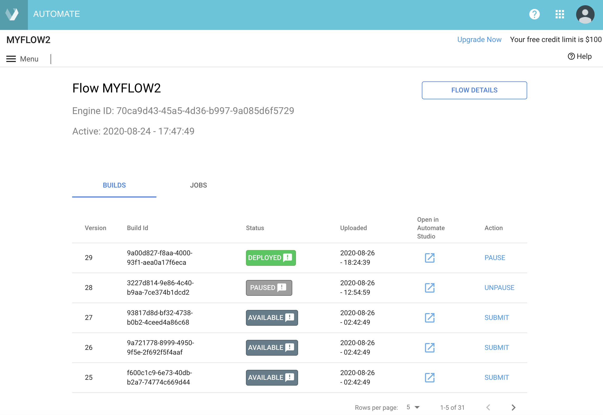
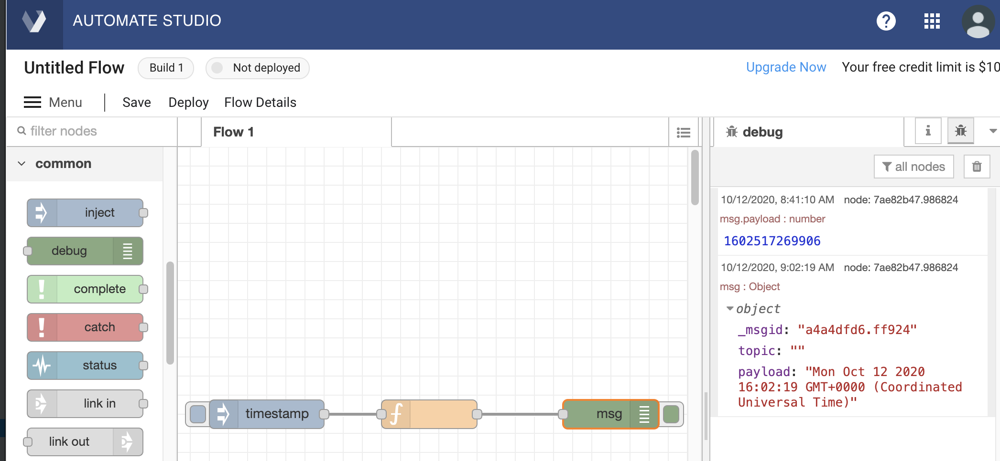

# Automate Studio Training: The Basics

Welcome to Automate Studio training! 

Veritone Automate Studio puts the power of AI in your hands to automate business processes quickly and easily, so you can get to solving business problems faster, with the power of AI. 

Using Automate's drag-and-drop UI, you can quickly map out your unique combination of data inputs, AI-powered business logic, and desired outputs, then deploy flows to deliver insights in the application of your choice in hours or days, not weeks or months.

In this unit, we take a look at the fundamentals of using Automate Studio.

**APPROXIMATE READING TIME: 15 MINUTES**

## What's Covered Here?

This page gives a high-level overview of Automate Studio's design-time features so you can quickly orient yourself to the UI. We'll look at:

* [The workspace](#workspace)
* [Node Palette](#node-palette)
* [Sidebar](#sidebar)
* [Nodes](#nodes)
* [Wires](#wires)
* [How to Run a Flow](#how-to-run-a-flow)
* [How to Rename a Flow](#how-to-rename-a-flow)
* [How to Save and Version a Flow](#how-to-save-and-version-a-flow)
* [Exercise: Create a Flow](#exercise-create-a-flow)

## Prerequisites for Using Automate Studio

There's nothing to install. Automate Studio runs as a web app. To use Automate Studio, you simply need:

1.  An active Automate Studio account. (Sign up [here](https://www.veritone.com/onboarding/#/signUp?type=automate) to create an account and gain immediate access to the application.)
2.  Access to the internet &mdash; Automate Studio is a Software-as-a-Service (SaaS)  application that runs in Veritone's Commercial or GovCloud environments. 
3.  Unstructured Data (optional) &mdash; Automate Studio runs on top of the Veritone aiWARE platform, which supports unstructured data such as audio, video, images, text, and more, for cognitive processing. Structured data can be correlated with cognitively processed unstructured data for greater insight.

## Automate Studio UI Components

Automate Studio features an intuitive, point-and-click design time environment that runs in your browser.



### Workspace

The workspace is your canvas, in which you can design and optionally run flows within Automate Studio. It is organized by tabs located at the top, one for each individual flow.

### Node Palette

Available node types are shown vertically in a _Node Palette_ on the left side of the workspace. Nodes are organized into sections that can be expanded or rolled up accordion-style.

Use the Manage Palette menu command under the main Menu to enable/disable, add, remove, or update nodes.

> **Tip:** Toggle the Node Palette's visibility using Command-P.

### Sidebar

Information about the currently selected node is shown in a resizable Sidebar on the right. Note that the Sidebar can display an Info panel, or a Debug panel. (Choose the view by clicking the _i_ or bug icon buttons at the top right.)

> **Tip:** Toggle the Sidebar's visibility using Command-spacebar.

### Nodes

Nodes are the building blocks of flows you create in Automate Studio.

Nodes allow your flow to receive input data, execute custom logic, and/or output data, within a flow. They can encapsulate custom business logic (written in JavaScript), or run GraphQL queries, as need be.
Individual nodes are typically responsible for discrete actions, such as executing a script, receiving input, transmitting outputs, etc. They can be triggered either by receiving a message from a previous node, or by an external event. 

Various types of prebuilt, ready-to-use nodes are available to you from the [Node Palette](#node-palette).



Input nodes act as their own data source; hence, they have only a single port, namely an _output port_ (the little circle on the right). 

Output nodes typically occur at the _end_ of a flow or subflow. They can receive data but do not pass data to any downstream node(s).

All other nodes are transformational or "function" nodes that take data in, modify it (or augment it), then pass the modified data out.

> Many of Automate Studio's prebuilt nodes are off-the-shelf Core nodes available in the open-source Node-RED project. Read more about [Core Nodes](https://nodered.org/docs/user-guide/nodes).

#### Node Terminology

Familiarize yourself with the basic features of nodes as depicted below:



Most nodes have an input "port" on the left and one or more output ports on the right. Output nodes have only an input port; input nodes have only output ports.

#### Adding Nodes to a Flow

Nodes can be added to the workspace canvas by dragging them from the Node Palette (on the left) and dropping them on the canvas.

Nodes are easy to work with:

* Drop a node anywhere. Drag it to any spot you want.
* Select a node and hit the Delete (or Backspace) key on your keyboard to delete it.
* Single-click a node to see information about it in the Node Info Panel in the sidebar on the right.
* Double-click any node to edit its Properties (settings).

#### Configuring a Node

Double-click any node, at any time, to open its Properties panel.

* Edit the **Name** field if you want to change the visible name of the node.
* Edit individual properties as needed, to configure the node. The actual properties available will depend on the type of node.

> When you are done editing a node's properties, remember to click the blue Save button, in order to save your changes.

### Wires

Nodes must be connected together to run as a flow. _Wires_ connect nodes together. A node can have at most one input; it nay have zero, one, or two outputs, depending on the tytpe of node.

To wire two nodes together, click the output port of a node and hold your mouse button down  while dragging a wire to the input port of a second node. 


#### Splitting Wires
     
To easily insert a node into a flow, drag a node to a spot in the middle of an existing wire. The wire becomes a dashed line. When you let go of the mouse, the node will automatically be inserted (properly wired) into the flow at that location.



#### Moving Wires

To move a wire that is already placed, press and hold the Shift key, then click on the port you would like to remove it from. Hold the Shift key and drag the wire to the new port. 

#### Deleting Wires

Simply select a wire and press the Delete key. Use Control-Z to Undo the action, if you need to.

> If a node is deleted, the wires connected to it will automatically be deleted as well.

## Flow Basics

### How to Run a Flow

If the first node in your flow is an **Inject** node (from the **common** section of the Node Palette), you can execute your flow at design time simply by clicking the button on the left side of the Inject node.

We'll have more to say about how to run a flow a little later.

### How to Rename a Flow

Single-click the flow name that appears at the top left of the screen, directly above the **Menu** (and below the Veritone icon).
A dialog will appear, allowing you to rename the flow.

### How to Save and Version a Flow

Saving your work is easy. In fact, it's automatic.

Your flow will be auto-saved every few seconds. You don't have to do periodic saves to avoid losing work.

> Note that if a particular node in your flow diagram contains unsaved changes, it will appear with a small blue-filled circle above it. The circle disappears after an auto-save.

When you want to save a _particular version_ of your flow so you can find it and load it again later, use the **Save** button near the Menu icon in the upper left corner of the designer window.
Clicking **Save** causes the flow to be persisted as a numbered _Build_. A toast notification will appear at the bottom of the screen, saying that the Save was successful; then the designer will refresh.

To visit your flows (that is to say, your _saved builds_) at any time, use the **Menu** at the top left and select **My Flows**. A new window will open, containing a list of flows you have created.
Click the name of the flow to open that flow in the flow designer. Otherwise, click the gear icon at the far right edge of the row to open a list of Builds (for that flow) in the Flow Details page.

Notice the links at the right edge of each row in the flow details page. Click the link under **Open in Automate Studio** to open a particular build in the designer canvas. Use the link at the far right to manage the build's state manually (the link may say **Pause, Unpause, Submit,** or **Deploy**).

!> A flow cannot be deleted while it is showing as **Deployed**. You must manually **Pause** the flow first (using the link on the far rightof the row). Then a kebab menu will appear on the right side of the detail row, containing a Delete command.



> **Tip:** If you ever need to re-open your flow in the canvas, you can also find it in the [Engines Overview page](https://developer.veritone.com/engines/overview); single-click any flow to open that flow's Builds page. From the Builds page, you can open any build in the Studio UI.

## Exercise: Create a Flow

Even if you haven't read the rest of this page, try this quick exercise.

### 1. Open a New, Blank Workspace

If you already have Automate Studio open in your browser, just select **New** from the Menu. A new instance of Automate Studio containing a blank canvas will open in a new tab.

> If you are not already in Automate Studio, go to https://automate.veritone.com/ and open any template. Then use **Menu > New**.

### 2. Add an Inject Node to the Canvas

In the Node Palette, scroll down to **common** nodes and drag an Inject node onto the canvas.

### 3. Add a Debug Node to the Canvas

Drag a Debug node (located in **common**) to the canvas. Its actual location on the canvas doesn't really matter, but for purposes of this exercise, try putting it on the right side of the canvas, well away from the Inject node.

### 4. Wire the Two Nodes Together

Click on the output port of the Inject node, and (without letting go of the mouse) drag out a wire to the input side of the Debug node. Then let go of the mouse.

### 5. Test the Flow

First, do this: Single-click the Debug node to select it, then click the bug icon in the sidebar to display the Debug panel. (Alternatively, type Control-g, release, and tap the 'd' key on your keyboard.)

Now _run_ the flow by clicking the square tab on the left edge of the Inject node. (You'll notice that your cursor changes appearance when you hover over the tab.)

When you run the flow, you should see the Debug pane update to show `msg.payload: number` and a number, like `1602518269906`. This means the flow ran successfully. A timestamp (representing the number of milliseconds since Jan. 1, 1970) was sent, in the `payload` field of the `msg` object, to your Debug node.

### 6. Make a Change to the Flow

Drag a Function node (from the  **function** section of the Node Palette) onto the wire that connects your Inject and Debug nodes. You will see the wire change to a dotted line before you release the mouse button. Release the mouse button when you see the dotted line.

Double-click the Function node to display that node's Properties panel.

In the Properties panel, under Function, change the code so that it looks like this:

```javascript
msg.payload = (new Date).toString();
return msg;
```

Click the **Done** button (in the Properties panel) to save your work.

Next, double-click the Debug node and change the Output property to `complete msg object`. (Use the dropdown menu to select that option.)

Click the **Done** button to save your changes.

### 7. Run the Edited Flow

Now run the flow and note the new message in the Debug panel. If you expand the message, you should see a plain-text date.



Congratulations! You created and edited your first flow!

## For More Information

For more information about Node-RED (the open-source technology behind Automate Studio), be sure to see [the Node-RED documentation](https://nodered.org/docs/).

