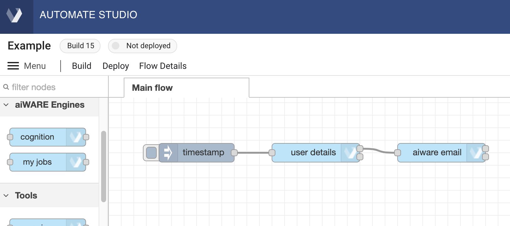
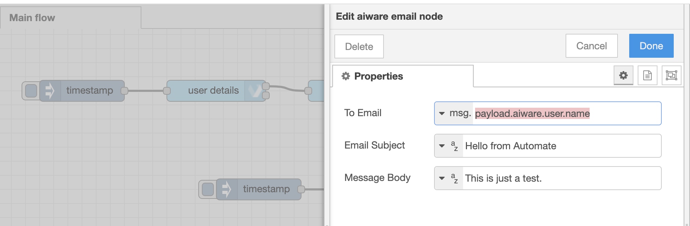
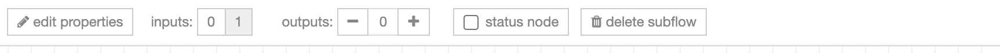
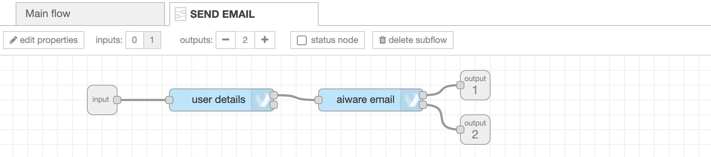
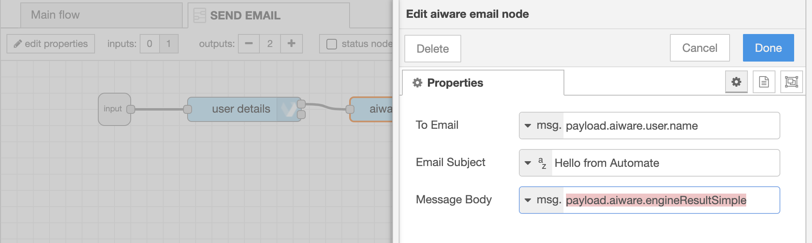
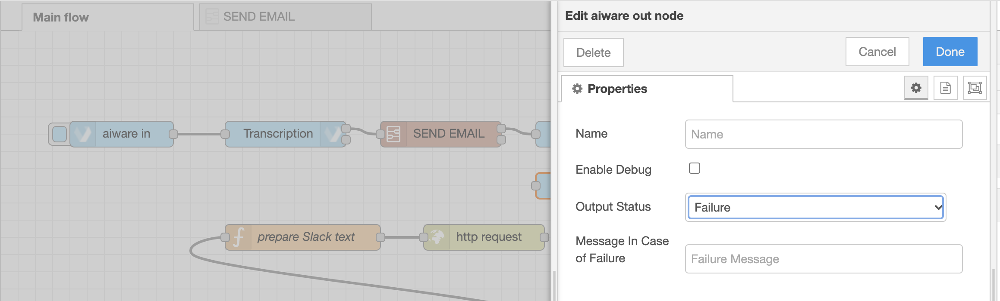
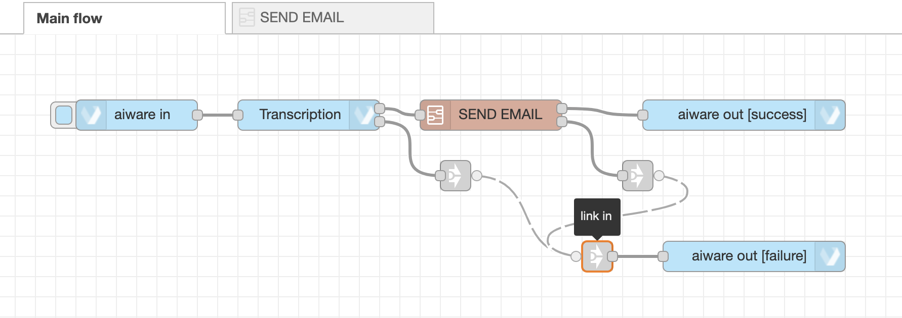
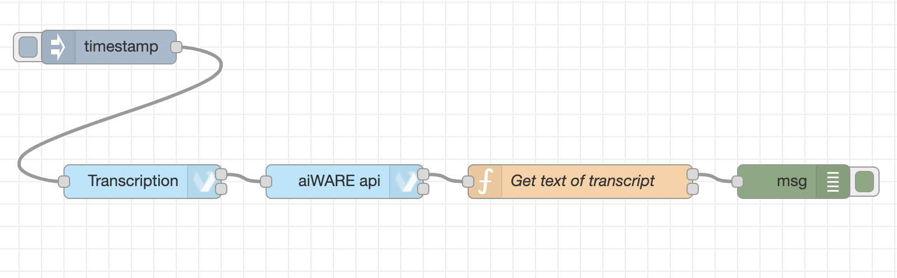
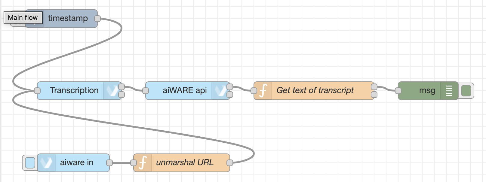

# Automate Studio Training: Cognition within a Flow


**APPROXIMATE READING TIME: 20 MINUTES**

In the two preceding lessons in this series, we've covered:

**The Basics:**
* [The workspace](automate-studio/Training/crawl.md#workspace)
* [Node Palette](automate-studio/Training/crawl.md#node-palette)
* [Sidebar](automate-studio/Training/crawl.md#sidebar)
* [Nodes](automate-studio/Training/crawl.md#nodes)
* [Wires](automate-studio/Training/crawl.md#wires)
* [How to Run a Flow](automate-studio/Training/crawl.md#how-to-run-a-flow)
* [How to Rename a Flow](automate-studio/Training/crawl.md#how-to-rename-a-flow)
* [How to Save and Version a Flow](automate-studio/Training/crawl.md#how-to-save-and-version-a-flow)
* [Exercise: Create a Flow](automate-studio/Training/crawl.md#exercise-create-a-flow)

**Working with Flows:**
* [Flow Creation Strategy](automate-studio/Training/walk/walk.md#flow-creation-strategy)
* [Understanding the `msg` object](automate-studio/Training/walk/walk.md#understanding-the-msg-object)
* [Working with the Change node](automate-studio/Training/walk/walk.md#working-with-the-change-node-nbspnbsp-img-srcdocsautomate-studiotrainingwalknode-changepng-styleheight40pxvertical-align-middle)
* [Working with the Function node](automate-studio/Training/walk/walk.md#working-with-the-function-node-nbspnbsp-img-srcdocsautomate-studiotrainingwalknode-functionpng-styleheight40pxvertical-align-middle)
* [How to use GraphQL in the API node](automate-studio/Training/walk/walk.md#working-with-the-aiware-api-node-nbspnbsp-img-srcdocsautomate-studiotrainingwalknode-apipng-styleheight40pxvertical-align-middle)
* [Understanding engines, builds, and jobs](automate-studio/Training/walk/walk.md#understanding-engines-builds-and-jobs)

In this unit, we'll build on these concepts in order to show how to create your own flows that use cognition with custom business logic.
We'll cover, among other things:

* [Creating a subflow](#convert-the-email-flow-to-a-subflow)
* [Invoking a subflow](#using-the-subflow)
* [How to use 'aiware out' nodes](#adding-aposaiware-outapos-nodes)
* [How to use 'link in' and 'link out' nodes to simply a flow](#use-aposlink-inapos-and-aposlink-outapos-to-simplify-the-flow)
* [How to add basic error handling](#add-basic-error-handling)

Follow along as we show the steps needed to create a simple flow that can obtain and process the transcribed text of a video's soundtrack.

> Note that there's almost always more than one way to achieve a desired outcome in Automate Studio. The example we'll be showing below represents just _one way_ to do a transcription job. The end result is similar to the result obtained in the sample transcription flow discussed in our [Getting Started guide](automate-studio/getting-started/README), but with some important changes to illustrate specific techniques and best practices.

## Create a Simple Email Flow

1\.  On a fresh canvas, drag out an **inject** node, a **user details** node, and an **aiware email** node. Connect the nodes by dragging out wires between neighboring nodes' input and output ports.



2\. Double-click the **aiware email** node to open its Properties. Use the dropdown control to set the "To Email" field to use `msg.` Then type `payload.aiware.user.name` into the text field alongside it.



3. Set the other properties to any convenient string values. Then click the blue **Done** button to save your properties and dismiss the edit pane.

### Test it

Click the ballot-box tab on the left side of the first node (the **inject** node) to kick off the flow. Within a few seconds, you should receive an e-mail at the address you used when you signed up for your Automate account.

## Convert the Email Flow to a Subflow

Sometimes it can be useful to package a flow into a _subflow_. (Subflows are like subroutines that can be invoked within the context of flow. You can have multiple subflows within a flow, or none at all. It's  up to you.)

To create a subflow:

1\. Drag out a selection rectangle around the nodes you want to include in your subflow. In this case, you want to select all three nodes.
When you let go of the mouse, your selected nodes will be outlined in red:


2\. Type Command-X (or Control-X) to Cut the nodes to the Clipboard. A popup says "3 nodes copied."

3\. Using the Menu, find and choose the **Create Subflow** command. A new tab opens in the canvas called "Subflow 1."

4\. Type Command-V (or Control-V) to Paste nodes from the Clipboard. A popup appears, saying "Imported: 3 nodes."

5\. Double-click the tab where it says "Subflow 1" to open the Properties editor for the tab. Change the name of the tab by typing "SEND EMAIL" in the **Name** property. Then click the blue **Done** button to save your changes.

> Notice that not only does the name of the subflow's tab update, but you can also now see your renamed subflow in the Node Palette, under **subflows**.

6\. Single-click the first node (the **inject** node, which has a default name of "timestamp"), _then backspace to delete it_. (The **inject** node cannot be used in a subflow, since subflows cannot run on their own.)

7\. At the top edge of the subflow canvas, notice the row of buttons.



Find and click the '1' next to **inputs**. This will drop a small **input** node onto the canvas. Wire it to the **user details** node.


8\. Find the '+' button next to **outputs** and click it twice to drop two **output** nodes onto the canvas. Wire the first one to the uppermost output port of the **aiware email** node, and wire the second one to the lowermost port of that node.



## Using the Subflow

Now let's see how to use the subflow from our main flow.

1\. Click on the **Main flow** tab, at the top of the canvas, to bring that tab to the front. The main flow's canvas should be empty.

2\. Drag out an **aiware in** node, a **cognition** node, and an **aiware out** node onto the canvas. Wire them sequentially.

3\. Open the **aiware in** node's Properties. Under **Test Options**, set **Inject Mock Data** to:

```json
{
    "url": "https://www.nasa.gov/mp3/591240main_JFKmoonspeech.mp3"
}
```

4\. Click the blue **Done** button (once in the JSON editor, and again in Properties) to save the change.

5\. Double-click your flow's **cognition** node to open up its Properties pane. Make the following changes:
    
 * Ensure the **Job Definition** field says "Engine selector" (the default).
 * Under Choose Engine, set **Cluster** to any available aiWARE Edge instance (such as "PROD-V3," if available).
 * Use the Category picker control to set the **Category** to "Transcription."
 * Use the Engine picker to select the **Engine** named "Speechmatics Transcription - English (Global) V3."
 * Find the **WaitForResults** checkbox and check it. (This is important, because you want cognition to be _complete_ before the flow proceeds to the next node.)
 * Set **Job Priority** to "Very High."
 * (Recommended) Change the **Name** field to have a value of "Transcription."
    
6\. Click the blue **Done** button to close and save the node's Properties.

7\. Now drag out a custom **SEND EMAIL** node from the **subflows** section at the top of the Node Palette, and drop it onto the wire that connects the output side of your Transcription node to the input of your final (**aiware out**) node. (Before you release the mouse, the wire will become a dotted line.)

8\. Before we run this flow, we need to make a simple change to the SEND EMAIL subflow so that our engine results appear in the email. Start by double-clicking the **SEND EMAIL** node in your flow to open its Properties.
Near the top left of the Properties pane, find the **Edit subflow template** button, and click it. The subflow opens in its own frontmost tab.

9\. In the subflow, open the **aiware email** node's Properties and change the **Message Body** to use a message of `msg.payload.aiware.engineResultSimple`. (First use the dropdown control on the left to select `msg.`, then type or paste text into the field to complete it.)



10\. Click the blue **Done** button to save the change. Then go back to the main flow.

## Adding &apos;aiware out&apos; Nodes

You should always add at least two **aiware out** nodes to any flow (representing Success and Failure responses). The **aiware out** node fulfills the important function of telling the aiWARE platform "This flow can be considered complete."

The flow we've been building already has one **aiware out** node. It's the final node in the flow, and we accepted its default of "success." But we should also add a "failure" node, to handle situations where a flow aborts or encounters server-related problems. Do this:

1\. Drag a new **aiware out** node onto the canvas. Open its Properties and change the **Output Status** to "Failure."



2\. Click the blue **Done** button to save the change.

## Use &apos;link in&apos; and &apos;link out&apos; to Simplify the Flow

1\. Find **link in** (under the **common** section of the Node Palette) and drag a node out onto the canvas. Wire it to the **aiware out** "failure" node.

2\. Find **link out** in the Node Palette. Drag two **link out** nodes on the canvas.
Drag out a wire from the lowermost output port of the **cognition** ("Transcription") node, to the input port of a **link out** node. Drag out a wire from the lowermost output port of the **SEND EMAIL** node, to the input of the second **link out** node.

3\. With a **link out** node _selected_ (so that its little round output port becomes visible), drag out a wire from the _output_ (right) side of the **link out** node, and join it to the _input_ (left) side of the **link in** node.
In similar manner, join the _other_ **link out** node to the input of the **link in** node. When you select (single-click) your flow's **link in** node, dotted lines will appear between all "link" nodes, and the flow will look similar to this:
 


> Note that when the **link in** node is _not_ selected, _no_ wires will be visible between  **link in** and **link out** nodes.

Your flow now has **aiware  out** nodes that can report Success _or_ Failure back to the aiWARE platform at runtime.

Because a failure could, in theory, happen during the cognition process _or_ in the email notification subflow, it's necessary to have multiple flow paths to the **aiware out** "failure" node.

> It's possible to hard-wire the bottom ports of the cognition and SEND EMAIL nodes directly to the **aiware out** "failure" node, and there's nothing wrong with that. But in a large flow, hardwired many-to-many connections quickly create a spaghetti maze. The thoughtful use of **link in** and **link out** nodes (and subflows!) can help you avoid that situation.

You can test your flow now by kicking it off manually clicking the ballot-box tab on the left side of the **aiware in** node (the first node). The flow will pause momentarily at the cognition node, while transcription processing takes place, before proceeding to completion. Depending on how big the audio (or video) input file is, this could mean a delay of a few seconds to a few minutes. But eventually, you should see an email appear in your inbox, containing the plaintext transcription of the input file.

## Add Basic Error Handling

Drag a **catch** node (from the **common** section of the Node Palette) onto the canvas. Wire its output port to the input port of your **aiware out** "failure" node.

By default, the **catch** node will catch errors thrown by any node on the same tab. Alternatively, you can adjust the node's Properties so that it responds only to errors produced by specific nodes.

When an error is thrown, all matching catch nodes will receive the message. The message is in a `msg.error` object, which has several  fields.

| field | meaning |
| -- | --- |
| `error.message` | the error message |
| `error.source.id` | the id of the node that threw the error |
| `error.source.type` | the type of the node that threw the error |
| `error.source.name` | the name, if set, of the node that threw the error |

If an error is thrown within a subflow, the error will get handled by any catch nodes within the subflow. If none exists, the error will be propagated up to the tab the subflow instance is on.


## Save Your Build

You've done a lot of work on your flow. And your work has been auto-saved, all along, by Automate. But it might be a good idea, at this point, to version and persist this flow as a new _build_. To do this, find and click the **Build** link, in the upper left of the workspace, next to the main Menu button.

The screen will show a "Saving" toast message, then refresh. The new build number will be displayed in a badge next  to  the flow's name at the top left of the workspace.

## Explore Further

To learn how to deploy your flow to aiWARE, see [Deploy and Run Your Automation Engine](automate-studio/getting-started/README?id=step-5-deploy-and-run-your-automation-engine) in our [Getting Started guide](automate-studio/getting-started/README).


<!--


## Using an 'api' node to fetch results

Normally, you could run a GraphQL expression like the following one to obtain the results of a job:

```graphql
query RESULTS {
  engineResults(jobId: "20114825_Tx4eqAIgLV") {
    records {
      jsondata      
    }
  }
}
```

Here, we have hard-coded the `jobId`, because we happen to know what it is. But in a real flow, the `jobId` won't be known in advance; you will instead need to _discover_ it programmatically, at runtime, by inspecting `msg.payload.aiwareJobId`. We can run a GraphQL query in a flow using the 'api' node. And we can substitute `msg.payload.aiwareJobId` into the query, if we follow a couple of simple rules.

Let's modify our flow the use an  'api' node that will look up our results. First, drag an 'api' node onto the canvas, positioning it immediately downstream of your Engine Job node. Open the 'api' node's Properties window (by double-clicking the node). Enter the following expression:

```graphql
query RESULTS {
  engineResults( jobId: "{{payload.aiwareJobId}}"  ) {
    records {
      tdoId
      jsondata
      assetId
    }
  }
}
```

Note that we don't _have_ to request `tdoId` and `assetId` info in our response. We're doing it just in case we want those IDs later. (This is one of the nice things about GraphQL: You can get back just as much, or as little, information as you want.)

Also:

* The `jobId`  argument is specified as `payload.aiwareJobId`. We don't need to put `msg.` in front of `payload.aiwareJobId`, because in this case it's implicit.

* To make sure our JavaScript variable (`payload.aiwareJobId`) is dereferenced properly at runtime, we surround it with double-staches (`{{` and `}}`).

* But because the mustache syntax works _only inside of strings_, we must surround our double-stache expression with quotation marks, to make sure it is treated as a string.

When our 'api' node executes, the GraphQL expression will be processed in such a way that the transcription job's ID (whatever it ends up being) will be plugged into our GraphQL expression, so that when that expression is sent to the Veritone GraphQL server, we'll get back the detailed info for our job.

> Note that Automate Studio takes care of silently provisioning your flow with an API token at runtime, so that you need not worry about authenticating to the API server yourself; the necessary token will be used automatically when the 'api' node executes.

When our GraphQL query executes, we'll get back a fairly large JSON object containing a surprising amount of detail. It will look something like this:

```pre
{
  "data": {
    "engineResults": {
      "records": [
        {
          "jsondata": {
            "sourceEngineId": "c0e55cde-340b-44d7-bb42-2e0d65e98255",
            "taskId": "20114825_Tx4eqAIgLVZEse8",
            "generatedDateUTC": "2020-11-25T17:36:54.650863326Z",
            "series": [
              {
                "startTimeMs": 300,
                "stopTimeMs": 660,
                "words": [
                  {
                    "word": "Thirty",
                    "confidence": 0.69,
                    "bestPath": true,
                    "utteranceLength": 1
                  }
                ],
                "language": "en"
              },
              {
                "startTimeMs": 660,
                "stopTimeMs": 1260,
                "words": [
                  {
                    "word": "seconds",
                    "confidence": 1,
                    "bestPath": true,
                    "utteranceLength": 1
                  }
                ],
                "language": "en"
              } # truncated for space reasons...
```

This snippet is truncated but shows what a raw transcript looks like in Veritone's [VTN Standard format](developer/engines/standards/engine-output/?id=engine-output-standard-vtn-standard).
As you can see, each word of the transcript comes with a start time and a stop time in milliseconds, plus other metadata, like a `confidence` value. You might need this kind of detailed info if you are building an interactive UI that displays text progressively, as a video (or audio file) plays.

But sometimes, you just want the text of the transcript, and nothing else. In that case, you need to harvest the words programmatically with custom logic. We can do that pretty easily, it turns out, using a Function node.

## Using custom logic to process engine results

Drag out a Function node and drop it onto the wire that connects your API node to the final Debug node of the flow. Double-click the Function node to open its Properties panel. Make the following changes:

* Change the **Name** field to something logical, like "Get text of transcript."

* Change **Outputs** to 2, at the bottom of the panel, using the spinner control.

* In the Function body, enter the following text:

```javascript
if (msg.payload.engineResults.records.length === 0) {
    return [null, 'No transcription data'];
}

// Get the path to the transcript in the vtn-standard JSON
let transcriptSeries = msg.payload.engineResults.records[0].jsondata.series;

// Harvest the words and put a space between each one
let transcript = transcriptSeries.map(s => s.words[0].word).join(' ');
msg.transcript = transcript;
return [msg, null];
```

Notice that we're not merely returning a `msg` value. Instead, we return an array with two members. That's because the node has two outputs: one for a normal return, and one for an error-based return. The first array member goes to the first output port. The second array member will get passed to the second (error) output port.

At this point, your flow might look something like this:



The Inject node ("timestamp") allows you to kick off the flow manually. The Engine Job node ("Transcription") will operate against our hard-coded test file (https://www.nasa.gov/62282main_countdown_launch.wav), and the flow will wait until cognition is complete (potentially a couple minutes).
When the transcription job finishes, its output (JSON conforming to Veritone's VTN Standard) will  be sent to a Function node ("Get text of transcript"), where our custom logic will extract the text into a single String that gets assigned to `msg.transcript`. The Debug node ("msg") ensures that we get a chance to inspect the transcript by viewing the node's debug pane.

If you run this flow, you should see (after a delay of two minutes or so) results show up in the debug pane:


## Preparing for Deployment

It wouldn't make much sense to put our flow into production in its current state, since it operates only against one specific test file, and produces output that can only be seen in a design-time window.
To make the flow more useful, we should modify it so that we can:

* Process any audio or video file. Ideally, we should be able to pass an arbitrary URL (or maybe an actual .mp3 or .mp4 file) into the flow, for processing.
* Have the _output_ of the flow sent to us (whether by e-mail, websocket messaging, FTP, HTTP, SMS, or whatever).

Let's make a few changes so that our flow can operate against any URL we send it at runtime, and so that the flow sends our results to us in a Slack message.

### Using the 'aiware-in' node

We can easily modify the flow so that it can be kicked off either manually _or_ via HTTP POST. The key is to add an **aiware-in** node at the beginning of the flow.

Drag an 'aiware-in' node from the Node Palette to the canvas. Also drag a new Function node onto the canvas (just after the 'aiware-in' node). Create wires so that the flow proceeds from 'aiweare-in' to the Function Node, and then to your "Transcription" node.



Open the Properties pane of the Function node and do the following:

1. Change the node's **Name** to "unmarshal URL".
2. Edit the Function body to contain this code: 

```javascript
const buf = msg.payload.aiwareChunk;
msg.payload.aiware.url = buf.toString('utf8');
return msg;
```

**What's happening here:** At runtime, an 'aiware-in' node receives a payload (which can come in the form of an HTTP body), which is in `msg.payload.aiwareChunk`.
By default, this payload is a Buffer object. 

-->


