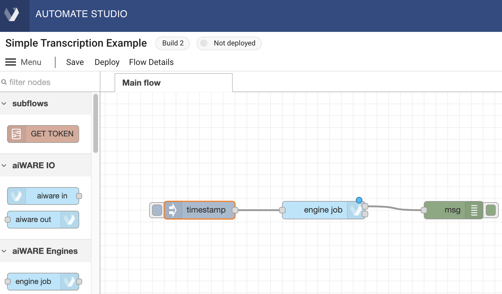
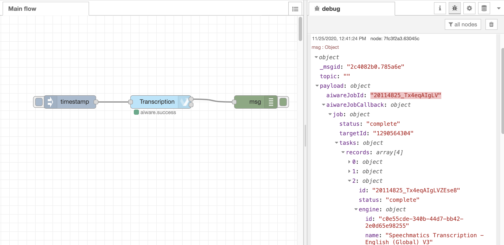

# Automate Studio Training: Cognition within a Flow


**APPROXIMATE READING TIME: 20 MINUTES**

In the two preceding lessons in this series, we've covered:

**The Basics:**
* [The workspace](automate-studio/Training/crawl.md#workspace)
* [Node Palette](automate-studio/Training/crawl.md#node-palette)
* [Sidebar](automate-studio/Training/crawl.md#sidebar)
* [Nodes](automate-studio/Training/crawl.md#nodes)
* [Wires](automate-studio/Training/crawl.md#wires)
* [How to Run a Flow](automate-studio/Training/crawl.md#how-to-run-a-flow)
* [How to Rename a Flow](automate-studio/Training/crawl.md#how-to-rename-a-flow)
* [How to Save and Version a Flow](automate-studio/Training/crawl.md#how-to-save-and-version-a-flow)
* [Exercise: Create a Flow](automate-studio/Training/crawl.md#exercise-create-a-flow)

**Working with Flows:**
* [Flow Creation Strategy](automate-studio/Training/walk/walk.md#flow-creation-strategy)
* [Understanding the `msg` object](automate-studio/Training/walk/walk.md#understanding-the-msg-object)
* [Working with the Change node](automate-studio/Training/walk/walk.md#working-with-the-change-node-nbspnbsp-img-srcdocsautomate-studiotrainingwalknode-changepng-styleheight40pxvertical-align-middle)
* [Working with the Function node](automate-studio/Training/walk/walk.md#working-with-the-function-node-nbspnbsp-img-srcdocsautomate-studiotrainingwalknode-functionpng-styleheight40pxvertical-align-middle)
* [How to use GraphQL in the API node](automate-studio/Training/walk/walk.md#working-with-the-aiware-api-node-nbspnbsp-img-srcdocsautomate-studiotrainingwalknode-apipng-styleheight40pxvertical-align-middle)
* [Understanding engines, builds, and jobs](automate-studio/Training/walk/walk.md#understanding-engines-builds-and-jobs)

In this unit, we'll build on these concepts in order to show how to create your own flows that combine cognition with business logic.
We'll cover, among other things:

* The engine-job node
* Using the api node to fetch engine results --  including how to use JavaScript in a GraphQL field value
* Dealing with errors
* Using custom logic to process engine results
* How to create a subflow
* How to deploy your flow into the aiWARE platform

Follow along as we show the steps needed to create a simple flow that can obtain the transcribed text of a video's soundtrack.

> Note that there's almost always more than one way to achieve a desired outcome in Automate Studio. The example we'll be showing below represents just _one way_ to do a transcription job.

## Using the 'engine-job' node

On a fresh canvas, drag out an Inject node, then drag out a Debug node. Connect the two nodes with a wire; then go into the Properties panel of the Debug node and set the Output to  'complete msg object' (using the handy dropdown control).

Now go back to the node palette and drag an Engine Job node onto the wire connecting your two existing nodes. The wire will become a dotted line; at that point, release the mouse button to drop the node onto the wire. It automatically becomes wired into the flow, with input coming from the Inject node and output going to the Debug node.



> A blue dot will appear (briefly) on the upper right edge of the Engine Job node, indicating that the flow has changed but has not yet been auto-saved. The dot will go away after a few seconds.

Double-click the Engine Job node to open its Properties. The Job Definition field should say "Engine selector" (the default).

* Change the **Name** field to some appropriate name, like "Transcription."

* Check the **WaitForResults** checkbox. This will cause the cognition job to run _synchronously_. (The default is asynchronous.) Running the job synchronously means the flow will not resume execution until this node has finished processing.
 
* For the field **Media URL or Recording ID**, enter the value https://www.nasa.gov/62282main_countdown_launch.wav (or, supply the URL to any .mp3, .mp4, or .wav file on the web; but try to pick a fairly _short-duration_ video or audio file, for testing). This will be the test file we will use at design time.

* For the **Cluster** field, use the picker control to select any available aiWARE Edge instance.

* For **Category**, use the picker to select Transcription. After a few seconds, the **Engine** picker (the next control) will populate.

* Use the **Engine** picker to select "Speechmatics Transcription - English (Global) V3."

* Important: Click the blue **Done** button (top right of panel) to save your Properties settings.

* You may also want to click the **Save** link at the top left of the main canvas, to persist your flow as a _build_, so that you can come back later and work on the flow some more, picking up exactly where you left off.

**What we did**: We just set up a flow containing a "cognition job" that will execute (using the Engine Job node), running against a test file (at the URL you specified in the Engine Job node's **Media URL or Recording ID** property).

If you were to run the flow right now (by clicking the tab on the left edge of the Inject node), it would run, taking a minute or two to process your test file, but the transcription results would not automatically show up in your flow, because the results must be fetched separately.

Try it, if you like. Run the flow, and (when it finishes) notice the JSON object that shows up in the Debug pane of your Debug node:



While a great deal of useful debugging info is available in the various properties of the `msg` object after the flow runs, the most useful value, for us, right now, is the one associated with the `msg.payload.aiwareJobId` field. (It's highlighted in the above screen shot.) We can use that ID to look up the results of the transcription job.

Let's see one way we can do that &mdash; using an API node.

## Using an 'api' node to fetch results

Normally, you could run a GraphQL expression like the following one to obtain the results of a job:

```graphql
query RESULTS {
  engineResults(jobId: "20114825_Tx4eqAIgLV") {
    records {
      jsondata      
    }
  }
}
```

Here, we have hard-coded the `jobId`, because we happen to know what it is. But in a real flow, the `jobId` won't be known in advance; you will instead need to _discover_ it programmatically, at runtime, by inspecting `msg.payload.aiwareJobId`. We can run a GraphQL query in a flow using the 'api' node. And we can substitute `msg.payload.aiwareJobId` into the query, if we follow a couple of simple rules.

Let's modify our flow the use an  'api' node that will look up our results. First, drag an 'api' node onto the canvas, positioning it immediately downstream of your Engine Job node. Open the 'api' node's Properties window (by double-clicking the node). Enter the following expression:

```graphql
query RESULTS {
  engineResults( jobId: "{{payload.aiwareJobId}}"  ) {
    records {
      tdoId
      jsondata
      assetId
    }
  }
}
```

Note that we don't _have_ to request `tdoId` and `assetId` info in our response. We're doing it just in case we want those IDs later. (This is one of the nice things about GraphQL: You can get back just as much, or as little, information as you want.)

Also:

* The `jobId`  argument is specified as `payload.aiwareJobId`. We don't need to put `msg.` in front of `payload.aiwareJobId`, because in this case it's implicit.

* To make sure our JavaScript variable (`payload.aiwareJobId`) is dereferenced properly at runtime, we surround it with double-staches (`{{` and `}}`).

* But because the mustache syntax works _only inside of strings_, we must surround our double-stache expression with quotation marks, to make sure it is treated as a string.

When our 'api' node executes, the GraphQL expression will be processed in such a way that the transcription job's ID (whatever it ends up being) will be plugged into our GraphQL expression, so that when that expression is sent to the Veritone GraphQL server, we'll get back the detailed info for our job.

> Note that Automate Studio takes care of silently provisioning your flow with an API token at runtime, so that you need not worry about authenticating to the API server yourself; the necessary token will be used automatically when the 'api' node executes.

When our GraphQL query executes, we'll get back a fairly large JSON object containing a surprising amount of detail. It will look something like this:

```pre
{
  "data": {
    "engineResults": {
      "records": [
        {
          "jsondata": {
            "sourceEngineId": "c0e55cde-340b-44d7-bb42-2e0d65e98255",
            "taskId": "20114825_Tx4eqAIgLVZEse8",
            "generatedDateUTC": "2020-11-25T17:36:54.650863326Z",
            "series": [
              {
                "startTimeMs": 300,
                "stopTimeMs": 660,
                "words": [
                  {
                    "word": "Thirty",
                    "confidence": 0.69,
                    "bestPath": true,
                    "utteranceLength": 1
                  }
                ],
                "language": "en"
              },
              {
                "startTimeMs": 660,
                "stopTimeMs": 1260,
                "words": [
                  {
                    "word": "seconds",
                    "confidence": 1,
                    "bestPath": true,
                    "utteranceLength": 1
                  }
                ],
                "language": "en"
              } # truncated for space reasons...
```

This snippet is truncated but shows what a raw transcript looks like in Veritone's [VTN Standard format](developer/engines/standards/engine-output/?id=engine-output-standard-vtn-standard).
As you can see, each word of the transcript comes with a start time and a stop time in milliseconds, plus other metadata, like a `confidence` value. You might need this kind of detailed info if you are building an interactive UI that displays text progressively, as a video (or audio file) plays.

But sometimes, you just want the text of the transcript, and nothing else. In that case, you need to harvest the words programmatically with custom logic. We can do that pretty easily, it turns out, using a Function node.

## Using custom logic to process engine results

Drag out a Function node and drop it onto the wire that connects your API node to the final Debug node of the flow. Double-click the Function node to open its Properties panel. Make the following changes:

* Change the **Name** field to something logical, like "Get text of transcript."

* Change **Outputs** to 2, at the bottom of the panel, using the spinner control.

* In the Function body, enter the following text:

```javascript
if (msg.payload.engineResults.records.length === 0) {
    return [null, 'No transcription data'];
}

//Break out the path to the transcript in the vtn-standard JSON
let transcriptSeries = msg.payload.engineResults.records[0].jsondata.series;

// Harvest the words and put a space between each one
let transcript = transcriptSeries.map(s => s.words[0].word).join(' ');
msg.transcript = transcript;
return [msg, null];
```

Notice that we're not merely returning a `msg` value. Instead, we return an array with two members. That's because the node has two outputs: one for a normal return, and one for an error-based return. The first array member goes to the first output port. The second array member will get passed to the second (error) output port.

** MORE TO COME **


