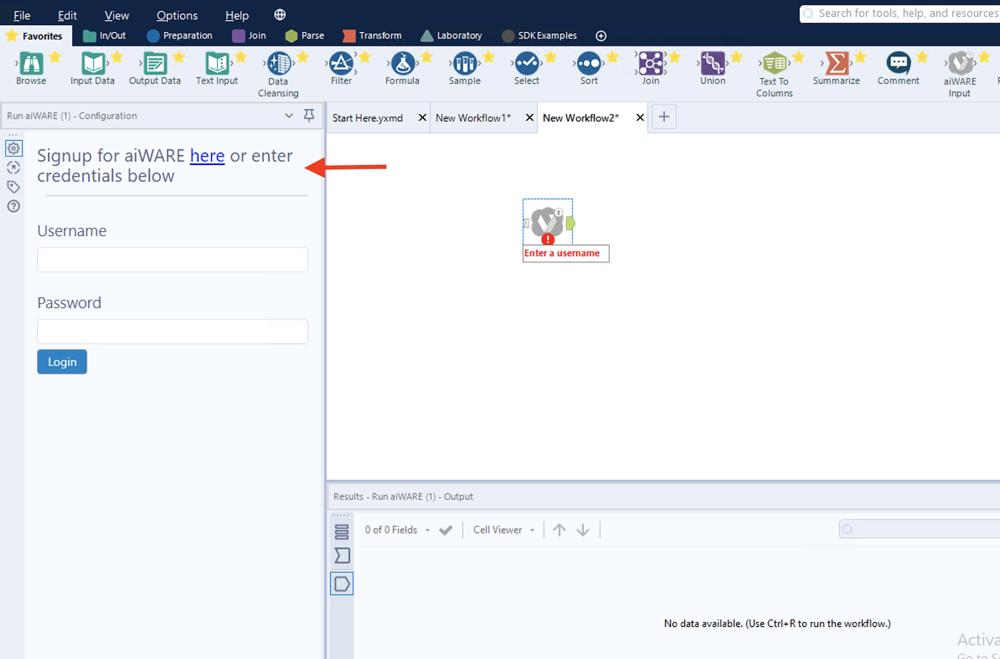
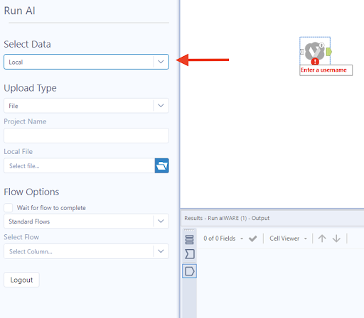
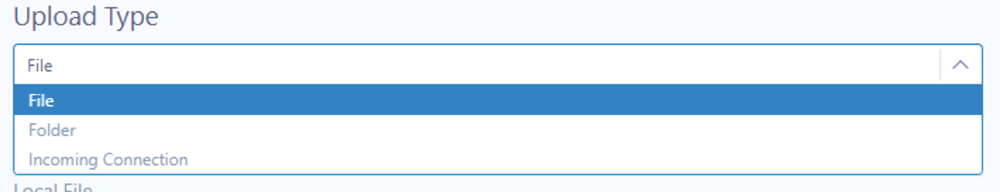
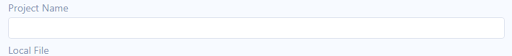
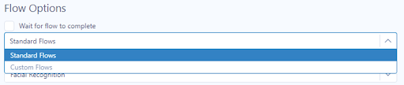

# Alteryx Tools

For users of [Alteryx](https://www.alteryx.com/), the **Run aiWARE** and **aiWARE Input** Alteryx tools unlock the power of Veritone’s scalable real-time cognitive capabilities, opening up new possibilities for customers who need to automate their business solutions while solving data-heavy problems using AI.

## Key Features

### Run aiWARE

* Input local, AWS S3-stored media and/or text files to run aiWARE cognition services directly from Alteryx.
* Single or Batch File Upload.
* Create your own AI library for cognition services.
* Run cognition services on existing Temporal Data Objects.
* Connect your own Alteryx inputs to the Veritone tools for unlimited workflow capabilities.
* Create custom cognitive flows in Veritone’s Automate Studio that can be directly used in Alteryx.

### aiWARE Input

* Query data from cognition jobs created by Run aiWARE.
* Create custom GraphQL queries based on your data.
* Parse data using Veritone’s custom helper macros.
* Connect your own input tools for unlimited workflow capabilities.

### Cognition Specifications

Cognition Types | Supported File Types
-- | --
Transcription | Audio, Video
Transcription with Speaker Separation | Audio, Video
Facial Detection | Video, Image
Object Detection | Video, Image
Text Recognition | Video, Image
Logo Recognition | Video, Image
License Plate Recognition | Video, Image
Entity Extraction | Text
Content Classification | Text
Sentiment Analysis | Text

#### File Types Supported

* Video: mp4, mpeg, ogg, qt, webm, m4v, x-ms-wmv, x-msvideo
* Audio: flac, midi, mp4, mpeg, wav, webmimage/gif
* Text: html, plainvideo/3gpp
* Image: jpeg, tiff/text/csv

#### Engine IDs and  Flow IDs

| flow\_name                            | flow\_id                             | cognition\_engine\_id                |
| ------------------------------------- | ------------------------------------ | ------------------------------------ |
| **Transcription**                         | f028aa9f-7006-4fa0-9316-fee1849b9e9b | c0e55cde-340b-44d7-bb42-2e0d65e98255 |
| **Transcription with Speaker Separation** | 1702e8c4-a9b9-49e8-99bf-e62e44d95e47 | 06c3f1d7-7424-407b-a3b5-6ef61154fc0b (speaker separation)<br/>c0e55cde-340b-44d7-bb42-2e0d65e98255 (transcription) |
| **Facial Detection**                      | e174e1e1-4d78-445f-a8bb-838e5cfa2b90 | df6e189f-8947-4c73-a30b-f786defc60e8 |
| **Text Recognition**                      | 42322baf-2099-4289-8f3c-709477cb86b6 | 1e5b4e36-acbe-49f1-bebf-1d3a0edd6219 |
| **Object Detection**                      | b8c40a49-943e-4da8-9d52-71a25437594b | 8530093b-0f03-4fd1-b83b-1f28a692ad13 |
| **Logo Recognition**                      | 2002f498-a626-4f5e-b421-04ce1b95fb71 | 18a9c4ca-ec3a-4d20-8985-c606f5e9eb89 |
| **Entity Extraction**                     | 0e4c76b9-5ff6-4f29-878e-ae162f751090 | 0bf3b38f-6022-412b-b58e-819a2b633786 |
| **License Plate Recognition**             | 357ad14e-8681-4072-a4ff-f70073c0c743 | 42ac5bc0-83d5-425c-ab5e-916a6584f4fd |
| **Content Classification**             | 018be0c5-dc4d-4f71-9398-6d50dd25d23b | 06bbc2e7-aa59-4c32-9ec3-1a147fff78a6 |
| **Sentiment Analysis**                    | 2865eaea-5c91-4260-abc3-596430fef2b6 | 76e005b3-1e5c-45c4-be45-c01b7371bb93 |

## Getting Started

When accessing the Veritone tools from the Alteryx canvas, the user will be required to sign in to Veritone's aiWARE platform. To create a new user account from the tool, click the link provided:



When you click the signup link, you will be prompted to create a new account in Veritone’s Automate Studio. This will give you access to the aiWARE platform to create AI libraries for cognition, custom cognition flows, and store your media files. See the [Automate Studio documentation](automate-studio/) for more details. 

Signing up takes only a few seconds. Provide an email and password. Once the account is created, you will get a verification email containing instructions on how to verify your account. Once verified, you will need to click back into the Alteryx canvas and onto the tool to bring yourself back to the sign-in page.

Congratulations: You now have access to the aiWARE Alteryx tool set!

## Run aiWARE Tool

The **Run aiWARE** tool allows Alteryx users to run aiWARE’s cognition services directly from Alteryx. Run aiWARE provides an easy file upload experience. To uploading a file or directory, proceed as follows:

### Step 1: Select Data for Cognition

If you haven't already done so, [create your free Veritone account](https://www.veritone.com/onboarding/#/signUp?type=automate&lead_source_detail=docs.veritone.com%2Fautomate-studio%2Fgetting-started).

In the **Run AI** UI, use the dropdown control to pick a data type. In the following illustration, you can see that *Local* has been selected.



The choices are:

* **Local** &mdash; Select a local file or folder to upload for cognitive processing.
	
* **Amazon S3** &mdash; Connect to an Amazon S3 bucket to run cognition services on any file.
	(Requires AWS Access Key and AWS Secret Key to grant access.)

* **Existing TDO** &mdash; Run cognition on an existing Temporal Data Object previously created using the Run aiWARE tool and stored in your aiWARE Organization. This can be helpful if you want to add additional cognition on previously ingested media.

#### Select Upload Type

There are three ways you can upload files to run cognition services. Use the dropdown control to choose the upload mode:



Choose:

* _File_ - To run cognition on a single file.
* _Directory Folder_ - To run cognition on a batch of files in a directory or folder. 
* _Incoming Connection_ - To create a series of inputs using Alteryx Tools to generate a list of files. 

**Project Name:** Input a project name to track, refine, and filter your aiWARE results.



### Step 2: Select Cognition Flow Options



Choose **Standard Flows**, **Custom Flows**, or **Upload Only**. 

**Standard Flows**: Select pre-built aiWARE cognition flows to run on your data. See the [documentation on Veritone’s Cognitive Technology](https://docs.veritone.com/#/cognitive-technology/) for more details. 

For available cognition types, refer to [Cognition Specifications](#cognition-specifications) above.

**Custom Flows**: You can use Veritone’s Automate Studio to create a custom flow that uses any engine, or a series of engines, to run cognition services. See the [documentation on Veritone’s Cognitive Technology](https://docs.veritone.com/#/cognitive-technology/) for more details.

**Upload Only**: Use this option if you would like to upload a file to your organizatin _without_ running cognition. 

> **Note:** Select “Wait for Flow to Complete” when you want to wait for the cognition engine(s) to finish before downstream tools in the Alteryx canvas run. This will allow you to utilize the results of an engine in those downstream tools. 

**Libraries**: Some cognition services will require the user to _train_ an engine, teaching it what to look for using a library. This will help refine the ability of the AI as to what it should identify. You can use the **Train Your First Library** link in the tool for a walkthrough on how to do this in your organization.

## aiWARE Input Tool

The **aiWARE Input** tool allows users to utilize GraphQL queries to retrieve cognition results from Veritone’s platform while working within Alteryx. Here’s how:

### Selection Options

**aiWARE Results** &mdash; _Project Names:_ Filter Results by Project Name.

**Custom Query Input** &mdash; Use this to make a custom graphQL Query, as opposed to the default Query that runs when selecting assets in the aiWARE Results option.

_Example Query:_ Get a list of TDOs, with associated assets, jobs, and tasks.

```graphql
query {
  temporalDataObjects {
    records {
      id
      name
      assets {
        records {
          id
          signedUri
          contentType
        }
      }
      jobs {
        records {
          id
          name
          status
          createdDateTime
          tasks {
            records {
              id
              engine {
                name
              }
              status
              startedDateTime
              completedDateTime
              output
            }
          }
        }
      }
    }
  }
}
```

**Incoming Connection Query** &mdash; Similar to Custom Query Input, but using an input from other tools in the Alteryx canvas, taking multiple records to make multiple queries at once.

Output for aiWARE Results:

| AssetId         | ContentType  | AssetType           | Signed URL   | Data                         |
| --------------- | ------------ | ------------------- | ------------ | ---------------------------- |
| _Id of the Asset_ | _Content/Type_ | _Veritone Media type_ | _Link to file_ | _JSON value containing Output_ |
