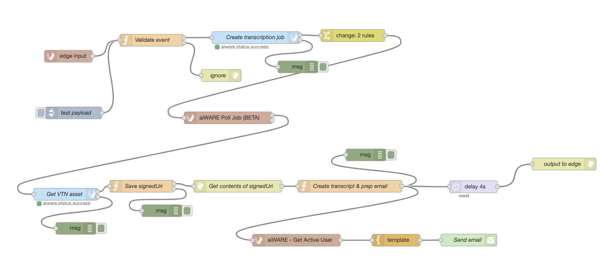

# Confidence Bot

*Blog Date: 2020-10-01*

When we talk about aiWARE offering an incredibly wide range of feature-functionality, we really mean it! Here is a tutorial example how you can not just retrieve the cognitive output that an AI/ML produces, but parse and *modify* the output depending on what you are trying to achieve with that output to begin with.

In this case, the Confidence Bot is a flow engine that retrieves a transcript for a given audio/visual file and creates a new text file where the confidence score generated by the AI/ML model is displayed next to each word.

## Tutorial Steps

1. The start of the Confidence Bot flow evaluates an inbound chunk sent from the Edge processing framework. The `inject` node payload mocks what the JSON of this chunk will resemble when it is injected into the flow engine at runtime.
2. First, the flow assigns some variables with the `change` node and then using the *tdoId*, we create a transcription processing job, assign two new variables and then use the aiWARE Poll subflow to poll the transcription engine job.
3. Once the transcription job has finished, we then query the newly created asset for the transcription engine results.
4. Next, the flow then parses the transcript and creates a new file that contains both the transcribed words *and* the confidence score next to each word.
5. The flow then retrieves the active user details associated with creating this flow engine request, formats the email with an aiWARE HTML template (you are welcome to reuse and modify! :blue_heart: ) and then sends to the user who created the processing request!
