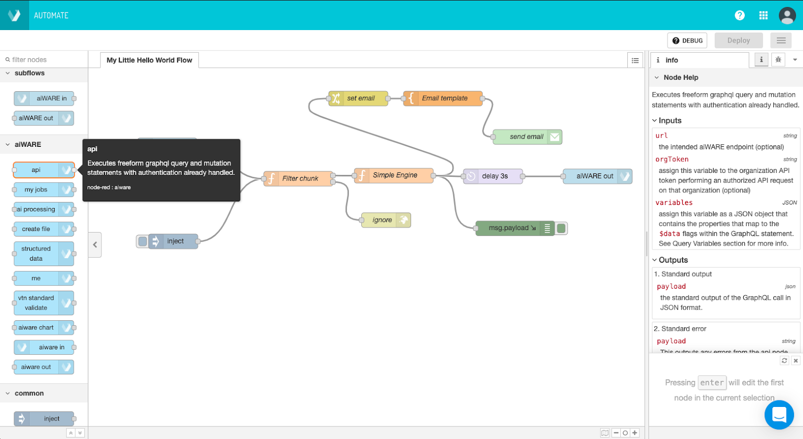
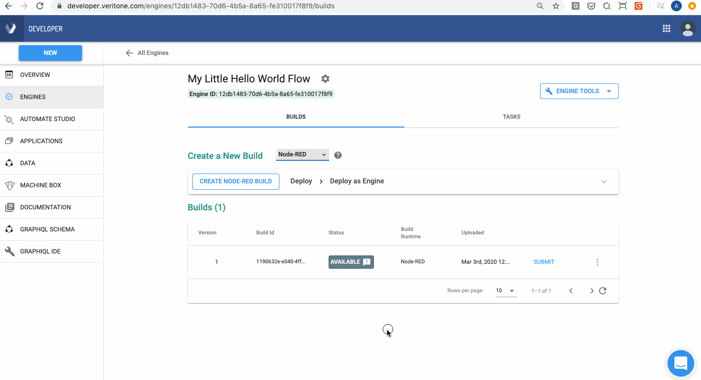
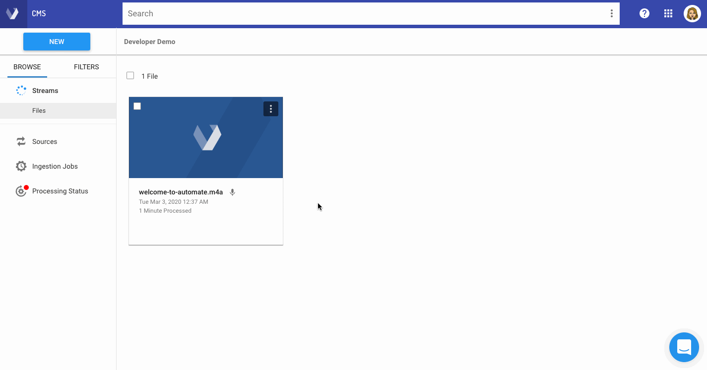

# Getting Started

Deploy AI solutions & automation, fast!
Learn to build your first flow in just a few minutes with this quickstart guide of Automate Studio.

## Step 1: Let's start with the building blocks

There are 3 key concepts we would like you to know:

1. Nodes: these are the shapes in the editor that input data, execute logic, and output that data to the next node until the last node in the flow graph.
2. Flow: this is an overall term for the "graph" that you define by dropping and connecting your nodes on the canvas.
3. Msg: the `msg` variable is the highest level variable that is sent from one node to another at flow runtime.

?> Tip: Hover your cursor over a node in the palette in the left menu to learn what it does.



## Step 2: Run and debug your flow

You've got the lingo, now let's start building!
In this sample flow below, the flow will display the user information. Connect the wire from the aiWARE api node to the green "debug" node like below and then click the blue Deploy button.
Nice! Now that you have connected your nodes together and deployed your changes, let's review what we have done:

1. We connected our api node to our debug node to display that output.
2. We then click the Deploy button to save our latest change. Once we have saved our changes, we can then run the latest version of this flow in the Automate Studio editor runtime.
3. Now, click the blue inject node to "inject" a `msg` JSON object into the flow.


## Step 3: Design your business logic

Design your custom business logic to reach the desired output. For example, you can click and drag a node from the Function menu in the palette into the center of your workspace.

?> Tip: Where is your data? Consider your data sources and how your logic in the flow connects one data silo to another.

## Step 4: Deploy your flow as an aiWARE Engine

You may have noticed that a snackbar notification appears in the bottom left corner of the screen after clicking the "Deploy" button to view your engine in Developer.
Tip: you can read more about flows and aiWARE's engine framework here.
Clicking the Deploy button saves the draft as a new flow engine build that is viewable in your Developer app.

## Step 5: Manage your new Automation Engine

You can manage, and deploy AI engines and applications in the Developer app.
Here in Developer, we are in an engine detail page and observe we have a new build record in this engine that has a Ready status. You can think of "builds" as draft versions of an engine.

Next, click on the “Submit” button next to the build, and then when the status changes, click the newly available “Deploy” button, to promote this version to the one actually that processes data.



## Step 6: Run your Engine and view the results

In this section, we are going to create an Engine job that will allow us to send our own payloads to a custom endpoint.

Once we have created this engine job, we can then run our flow engine by sending custom payloads to the endpoint generated when we created the engine job. Let's do it!

First, run this mutation in the [Sandbox](https://api.veritone.com/v3/graphiql)

```graphql
mutation createYourFlowEngineJob {
  createJob(input: {
    target: {
      startDateTime:1574311000
       stopDateTime: 1574315000
    }
    ##V3 Prod Cluster
    clusterId :"rt-1cdc1d6d-a500-467a-bc46-d3c5bf3d6901"
    ##Tasks with IOFolders
    tasks: [
        {
          # "correlationTaskId": "PA_TASK_ID",
          # "dueDateTime": "0001-01-01T00:00:00Z",
          engineId: "bb544ade-461c-11ea-8604-a3b3a83f5182"
          ioFolders: [
            {
              referenceId: "PA_OUTPUT"
              mode: chunk
              type: output
            }
          ]
        }
        {
          # This is the task that is an instance of the flow engine you created in Automate Studio!
          engineId: "<your flow engine id!>"
          ioFolders: [
            {
              referenceId: "MY_INPUT"
              mode: chunk
              type: input
            }
          ]
        }
      ]
    ##Routes : A route connect a parent output folder to a child input folder
    routes: [
        {
          ## HTTP Push Adapter route
          # The endpoint MUST be a UUID, you can generate one from a website
          endpoint: "< YOUR ENDPOINT GUID >"
          parentIoFolderReferenceId: "PA_OUTPUT"
          childIoFolderReferenceId: "MY_INPUT"
          options: {}
        }
      ]
  }) {
    targetId
    id
    targetId
    clusterId
    tasks {
      records{
        id
        engineId
        payload
        taskPayload
        status
        output
        ioFolders {
          referenceId
          type
          mode
        }
      }
    }
    routes {
      parentIoFolderReferenceId
      childIoFolderReferenceId
    }
  }
}
```

Secondly, we can now send our own payloads to this REST endpoint:

?> You can make REST requests with the cURL program in your computer's Terminal, or you can use a GUI app like Postman or Insomnia

```cURL
Method: POST
Url: https://controller-v3f.aws-prod-rt.veritone.com/edge/v1/proc/endpoint/{Your Endpoint GUID here!}

Body:
{ "edgePayload":
  {
  "tdoId":"<File ID from your org>",
  "sendTo":"<your email>",
  "firstName":"<your firstname>"
  }
}
```

It is only necessary to make POST request to your custom endpoint with this sample payload. The logic we constructed in the flow earlier was created to handle this payload and serve as an example of all the cool things we can build orchestrating our own cognition in the flow engine!

Once a payload body was submitted to the REST endpoint, navigate to CMS app using the app switcher (top right), and select the file as seen in the GIF below. When the engine completes, you can view a new output of that engine as well as a notification sent to the email of your Veritone account!



**Congrats!** You’ve built and run your first flow engine.
Now, take for a spin the existing pre-built flows in your organization, or create your own flow engines.

?> Need help or have a question? Contact us in our [Slack Community.](http://veritonedev.slack.com/)
