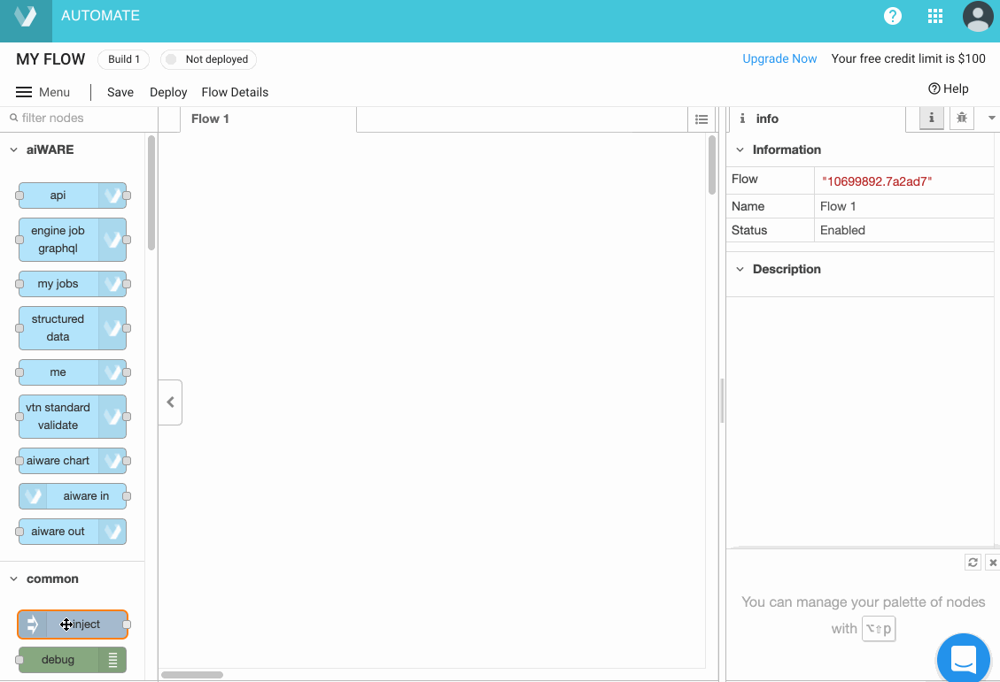
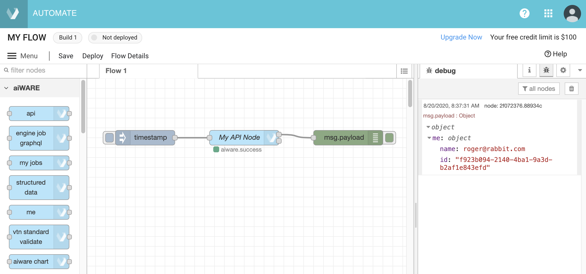
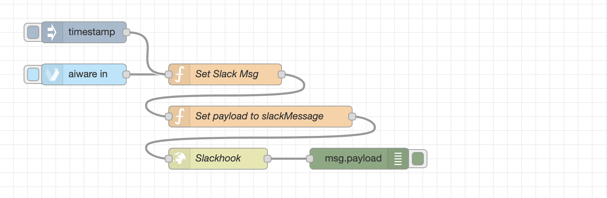

# Getting Started with Automate Studio

Learn to build your first flow in just a few minutes with this quickstart guide of Automate Studio.

## Step 0: Learn about the Building Blocks

Before we create a flow, let's quickly look at the main concepts you need to know about. This only takes a second!

<div class="collapse-accordion"><ul><li>
                <input type="checkbox" id="list-item-1">
                <label for="list-item-1"><span class="expandText">Click here to learn about the main concepts</span><span class="collpaseText">Click here to close this section.</span></label>
                <ul>
                    <li>

The 4 main concepts you need to know about are:

1. **Nodes:** These are the shapes in the editor that represent discrete steps in your flow.
2. **Wires:** These are the lines that connect the nodes together.
3. **Flow:** This is an overall term for the "graph" (or node-and-wire model) that you define by dropping and connecting your nodes on the canvas.
4. **Message:** The `msg` variable is the highest level variable that is sent from one node to another at flow runtime.

> **Tip:** Hover your cursor over a node in the node palette, on the left, to learn what a given type of node does.


### Nodes Are Easy to Work With

&#9642; To put a node in your graph, just drag any node from the node palette to the canvas, and let go of the mouse.

&#9642; Single-click a node on the canvas to select it. When it is selected, hit the Delete or Backspace key on your keyboard to delete it. 

&#9642; Click and drag from the _output_ endpoint on the right side of a node, to the _input_ endpoint on the left side of a second node, to connect two nodes with a wire.

&#9642; Use Ctrl-Z to Undo any action.

</li>                  
</ul>
</li>          
</ul>
</div>

## Step 1: Create a Flow

Automate Studio provides a super-quick drag-and-drop design experience. Creating a flow is a snap. Here's how.

<div class="collapse-accordion"><ul><li>
                <input type="checkbox" id="list-item-2">
                <label for="list-item-2"><span class="expandText">Click here to learn how to create a flow</span><span class="collpaseText">Click here to close this section.</span></label>
                <ul>
                    <li>
                    
If you haven't already done so, create your free account at [https://developer.veritone.com/automate-studio/overview](https://developer.veritone.com).

1\. In the upper right corner of that page, click the CREATE NEW button. The **Create New Flow Engine** page will open.


2\. You can click the SELECT A TEMPLATE button in the upper right, if you want to select a prebuilt, templated flow to edit.
Otherwise, enter a **Name** and an optional **Description** for your flow, then accept the other defaults and click the CREATE button at the bottom of the page.
After a few seconds, the Automate Studio design-time environment will open.

</li>                  
</ul>
</li>          
</ul>
</div>

## Step 2: Add Nodes to Your Flow

You've got the basics, now let's start building out our flow &mdash; and test it right in the design-time UI!

<div class="collapse-accordion"><ul><li>
                <input type="checkbox" id="list-item-3">
                <label for="list-item-3"><span class="expandText">Click here to learn how to build and test a flow</span><span class="collpaseText">Click here to close this section.</span></label>
                <ul>
                    <li>
                    
In this super-simple example, we'll create a 3-node flow that displays your user information. 

1\. From the node palette on the left, drag an **inject** node (visible under Common) onto the canvas.

2\. Also drag an **api** node (visible under aiWARE), and a **debug** node (from Common) onto the canvas. And click the _bug_ icon in the information pane, on the right, to enable the display of debug messages. Your canvas should look liker this:



3\. Click and drag from the output of the first node to the input of the second node. When you let go of the mouse button, a wire will appear.

4\. Create a wire from the middle node to the **debug** node.

5\. Double-click on the middle node (the **aiWARE api** node). Notice that a detail pane opens, allowing you to edit the **api** node's contents.

6\. Delete the existing contents and Paste the following:

```graphql
query {
  me {
    name
    id
  }
}
```

> When your flow executes, this simple GraphQL query will retrieve your user info.

7\. Click the blue **DONE** button in the upper right part of the edit pane. The pane goes away.

Nice! Now your flow is ready to run.

### Test the Flow

Click once on the ballot-box square at the left edge of the first node (the node labelled "timestamp"). This runs the flow, from start to finish.

Look to see that your Debug pane (on the right) is showing details from the query. You should see something like this:



#### What Just Happened

Automate Studio ran your flow and executed the `me` GraphQL query by submitting it to Veritone's GraphQL server.
The JSON results returned by the server got appended to your flow's `msg.payload` variable.
(Every flow has a global `msg` object that gets passed from node to node.)

</li>                  
</ul>
</li>          
</ul>
</div>

## Step 3: Design Your Business Logic

<div class="collapse-accordion"><ul><li>
                <input type="checkbox" id="list-item-3a">
                <label for="list-item-3a"><span class="expandText">Click here to learn how to add logic to your flow</span><span class="collpaseText">Click here to close this section.</span></label>
                <ul>
                    <li>
                    
Design your custom business logic to achieve the desired output. Drag and drop various node types as appropriate.
For example, you can click and drag a **function** node from the Function menu in the palette into the center of your workspace, edit its settings, and connect it to other nodes. (Double-click any node, at any time, to explore and/or edit its settings.)

?> **Tip:** Where is your data? Consider your data sources and how your logic in the flow connects one data silo to another.

### Getting Data Into Your Flow

The first node in your flow should be an **aiware-in** node. This will allow your flow to receive data POSTed to the flow's endpoint webhook via HTTP. (See Step 5 for an example of how to run a flow and push data to it.)

For test purposes, of course, you can use an Inject node to kick off your flow at design time; and this node can be wired into the flow in parallel to an aiware-in node, as shown below.



> **Note:** If you change a node's settings, be sure to click the **Done** button in the Edit pane to save your edits.

</li>                  
</ul>
</li>          
</ul>
</div>

## Step 4: Save Your Flow

Saving your work is easy. Versioning is easy, too.

<div class="collapse-accordion"><ul><li>
                <input type="checkbox" id="list-item-4">
                <label for="list-item-4"><span class="expandText">Click here to learn how to Save a flow</span><span class="collpaseText">Click here to close this section.</span></label>
                <ul>
                    <li>

Your flow will be auto-saved every few seconds. You don't have to do periodic saves to avoid losing work.

> Note that if a particular node in your flow diagram contains unsaved changes, it will appear with a small blue-filled circle above it. The circle disappears after an auto-save.

When you want to save a _particular version_ of your flow so you can find it and load it again later, use the **Save** button near the Menu icon in the upper left corner of the designer window.
Clicking **Save** causes the flow to be persisted as a numbered _Build_. A toast notification will appear at the bottom of the screen, saying that the Save was successful; then the designer will refresh.

To visit your flows at any time, use the **Menu** at the top left and select **My Flows**. A new window will open, containing a list of flows you have created.
Click the name of the flow to open that flow in the flow designer. Otherwise, click the gear icon at the far right edge of the row to open a list of Builds (for that flow) in the Flow Details page.

Notice the links at the right edge of each row in the flow details page. Click the link under **Open in Automate Studio** to open a particular build in the designer canvas. Use the link at the far right to manage the build's state manually (the link may say **Pause, Unpause, Submit,** or **Deploy**).

!> A flow cannot be deleted while it is showing as **Deployed**. You must manually **Pause** the flow first (using the link on the far rightof the row). Then a kebab menu will appear on the right side of the detail row, containing a Delete command.


> **Tip:** If you ever need to re-open your flow in the canvas, you can also find it in the [Engines Overview page](https://developer.veritone.com/engines/overview); single-click any flow to open that flow's Builds page. From the Builds page, you can open any build in the Studio UI.

</li>                  
</ul>
</li>          
</ul>
</div>

## Step 5: Deploy and Run Your Automation Engine

With the click of a button, you can deploy a flow into aiWARE &mdash; and run it in a Job.

<div class="collapse-accordion"><ul><li>
                <input type="checkbox" id="list-item-5">
                <label for="list-item-5"><span class="expandText">Click here to learn how to Deploy and Run a flow</span><span class="collpaseText">Click here to close this section.</span></label>
                <ul>
                    <li>

It's easy to deploy a flow into aiWARE, without leaving the Studio UI. Just click the Deploy button in the upper left. A dialog will appear:


Accept the default settings (**Run now**) if you want to deploy your current build and run it in a Job. 

Otherwise, click the **Deploy only** radio button, if you simply want to _deploy_ the build, to make it available in aiWARE.

If you've chosen **Run now**, copy the **HTTP Endpoint** URL (using the copy-to-clipboard button), then click the **Submit** button.
After a few seconds, a toast message will appear in the lower left part of the window, saying "Job has been created." A link is provided in the toast notification so that you can go directly to the Job Details page, if desired.


To test that your flow is running, you can use `curl` or Postman (or your own tool) to POST a test payload (e.g., a JSON object) to the HTTP Endpoint URL you copied above.
If the Job started successfully, you should get an HTTP 200 response to your POST. (Otherwise, you may get 404, in which case you should try again.)

> Tip: You can use an **e-mail node** at the end of your flow to send yourself a confirmation e-mail when the flow executes. You could also use **websocket** or **http request** nodes for sending output.

</li>                  
</ul>
</li>          
</ul>
</div>

## Running a Job Programmatically

In this section, we look at how to use GraphQL to create a Job in aiWARE that uses our automation engine. 

<div class="collapse-accordion"><ul><li>
                <input type="checkbox" id="list-item-6">
                <label for="list-item-6"><span class="expandText">Click here to learn how to run your flow in aiWARE</span><span class="collpaseText">Click here to close this section.</span></label>
                <ul>
                    <li>
                    
Create the following mutation in the [Playground](https://api.veritone.com/v3/graphiql), substituting your flow's _engine ID_ (not build ID) where `"<your flow engine id!>"` appears below.
Also provide a GUID for the `endpoint` field. (You can use the last segment of the HTTP Endpoint URL shown in the Deploy dialog. The GUID should look something like `6d87fe1f-7c3c-4cd8-b680-2ac5e15ce571`.)

```graphql
mutation createYourFlowEngineJob {
  createJob(input: {
    target: {
       startDateTime:1574311000
       stopDateTime: 1574315000
    }
    ##V3 Prod Cluster
    clusterId :"rt-1cdc1d6d-a500-467a-bc46-d3c5bf3d6901"
    ##Tasks with IOFolders
    tasks: [
        {
          # "correlationTaskId": "PA_TASK_ID",
          # "dueDateTime": "0001-01-01T00:00:00Z",
          engineId: "bb544ade-461c-11ea-8604-a3b3a83f5182"
          ioFolders: [
            {
              referenceId: "PA_OUTPUT"
              mode: chunk
              type: output
            }
          ]
        }
        {
          # This is the task that is an instance of the flow engine you created in Automate Studio!
          engineId: "<your flow engine id!>"
          ioFolders: [
            {
              referenceId: "MY_INPUT"
              mode: chunk
              type: input
            }
          ]
        }
      ]
    ##Routes : A route connect a parent output folder to a child input folder
    routes: [
        {
          ## HTTP Push Adapter route
          # The endpoint MUST be a UUID, you can generate one with an online app
          endpoint: "< YOUR ENDPOINT GUID >"
          parentIoFolderReferenceId: "PA_OUTPUT"
          childIoFolderReferenceId: "MY_INPUT"
          options: {}
        }
      ]
  }) {
    id
    targetId
    clusterId
    tasks {
      records{
        id
        engineId
        payload
        taskPayload
        status
        output
        ioFolders {
          referenceId
          type
          mode
        }
      }
    }
    routes {
      parentIoFolderReferenceId
      childIoFolderReferenceId
    }
  }
}
```

When you execute this mutation, you will launch a Job that runs your flow.
You can then POST data to your engine's webhook, which will be the HHTP Endpoint shown in the Deploy and Run dialog (see graphic further above). The webhook will look something like `https://automate-controller-v3f.aws-prod-rt.veritone.com/edge/v1/proc/endpoint/6d87fe1f-7c3c-4cd8-b680-2ac5e15ce571`.

> You can POST data with the cURL program in your computer's Terminal, or you can use a GUI app like Postman or Insomnia.

```cURL
Method: POST
Url: https://controller-v3f.aws-prod-rt.veritone.com/edge/v1/proc/endpoint/{Your Endpoint GUID here!}

Body:
{ "edgePayload":
  {
  "tdoId":"<File ID from your org>",
  "sendTo":"<your email>",
  "firstName":"<your firstname>"
  }
}
```

</li>                  
</ul>
</li>          
</ul>
</div>

## Congratulations!

Congratulations on building and running your first flow engine using Automate Studio.

?> Need help or have a question? Contact us in our [Slack Community.](http://veritonedev.slack.com/)

<style>
label {
        color: #fff;
    }
    
    .markdown-section code {
        border-radius: 2px;
        color: #322;
        font-size: .8rem;
        margin: 0 2px;
        padding: 3px 5px;
        white-space: pre-wrap;
    }
    
    .collapse-accordion { width:83%; }

    .collapse-accordion ul {
        list-style: none;
        margin: 0;
        padding: 0;
    }

    .collapse-accordion label {
        display: block;
        cursor: pointer;
        padding: 4px 32px;
        border: 1px solid #fff;
        border-radius: 7px;
        border-bottom: none;
        background-color: #766;
        position: relative;
    }

    .collapse-accordion label:hover {
        background: #999;
    }

    .collapse-accordion label:after {
        content: "";
        position: absolute;
        width: 8px;
        height: 8px;
        text-indent: -9999px;
        border-top: 1px solid #f2f2f2;
        border-left: 1px solid #f2f2f2;
        -webkit-transition: all .3s ease-in-out;
        transition: all .3s ease-in-out;
        text-decoration: none;
        color: transparent;
        -webkit-user-select: none;
        -moz-user-select: none;
        -ms-user-select: none;
        user-select: none;
        transform: rotate(135deg);
        left: 10px;
        top: 50%;
        margin-top: -5px;
    }

    .collapse-accordion input[type="checkbox"]:checked+label:after {
        transform: rotate(-135deg);
        top: 20px;
    }

    .collapse-accordion input[type="radio"]:checked+label:after {
        transform: rotate(-135deg);
        top: 20px;
    }

    .collapse-accordion label.last {
        border-bottom: 1px solid #fff;
    }

    .collapse-accordion ul ul li {
        padding: 10px;
        
    }


    .collapse-accordion input[type="checkBox"] {
        position: absolute;
        left: -9999px;
    }
    
    .collapse-accordion input[type="radio"] {
        position: absolute;
        left: -9999px;
    }

    .collapse-accordion input[type="checkBox"]~ul {
        height: 0;
        transform: scaleY(0);
      transition: transform .2s ease-out;
    }
    
    .collapse-accordion input[type="radio"]~ul {
        height: 0;
        transform: scaleY(0);
        transition: transform .5s ease-out;
    }

    .collapse-accordion input[type="checkBox"]:checked~ul {
        height: 100%;
        transform-origin: top;
        transition: transform .5s ease-out;
        transform: scaleY(1);
    }

   .collapse-accordion input[type="radio"]:checked~ul {
        height: 100%;
        transform-origin: top;
        transition: transform .2s ease-out;
        transform: scaleY(1);
    }

    .collapse-accordion input[type="checkBox"]:checked+label {
        background:#bda0a0;
        border-bottom: 1px solid #fff;
    }

    .collapse-accordion input[type="radio"]:checked+label {
        background: red;
        border-bottom: 1px solid #fff;
    }

    .collapse-accordion input[type="checkbox"]:checked+label .collpaseText {
        display: block;
    }

   .collapse-accordion input[type="radio"]:checked+label .collpaseText {
        display: block;
    }

    .collapse-accordion input[type="checkbox"]:checked+label .expandText {
        display: none;
    }

.collapse-accordion input[type="radio"]:checked+label .expandText {
        display: none;
    }

    .collpaseText {
        display: none;
    }

.info {
  margin-top: 50px;
color: #000;
  font-size: 24px;
}
.info span {
  color: red;
}
</style>