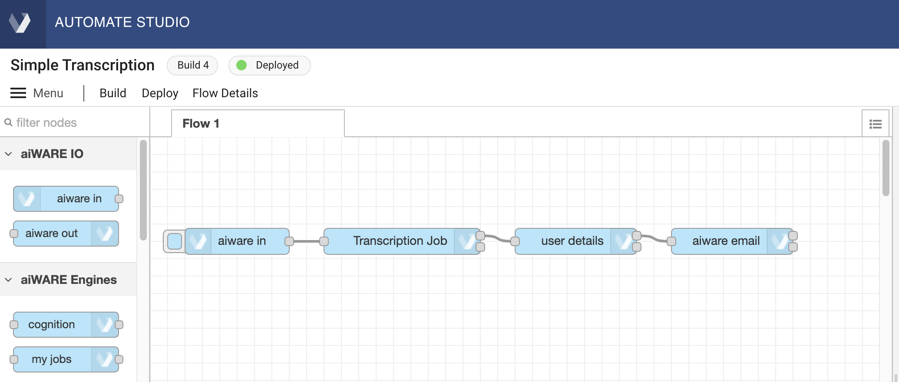

# Getting Started with Automate Studio

Learn to build your first flow in just a few minutes with this quickstart guide of Automate Studio.

## Step 0: Learn about the Building Blocks

Before we create a flow, let's quickly look at the main concepts you need to know about. This only takes a second!

<div class="collapse-accordion"><ul><li>
                <input type="checkbox" id="list-item-1">
                <label for="list-item-1"><span class="expandText">Click here to learn about the main concepts</span><span class="collapseText">Click here to close this section.</span></label>
                <ul>
                    <li>

The main concepts you need to know about are:

1. **Nodes:** These are the button-like shapes in the editor that represent discrete steps in your flow.
2. **Wires:** These are the lines that connect the nodes together.
3. **Flow:** This is an overall term for the "graph" (or node-and-wire model) that you define by dropping and connecting your nodes on the canvas.
4. **Message:** The `msg` variable is the highest level variable that is sent from one node to another at flow runtime.
5. **Flow Engines:** After a flow is created, it can be built, deployed, and run as an _engine_ in aiWARE. (This is a more advanced topic, but we will get to it shortly.)

> **Tip:** Hover your cursor over a node in the node palette, on the left, to learn what a given type of node does.


</li>                  
</ul>
</li>          
</ul>
</div>

## Step 1: Create a Flow

Automate Studio provides an easy drag-and-drop design experience. Creating a flow is a snap. Here's how.

<div class="collapse-accordion"><ul><li>
                <input type="checkbox" id="list-item-2">
                <label for="list-item-2"><span class="expandText">Click here to learn how to create a flow</span><span class="collapseText">Click here to close this section.</span></label>
                <ul>
                    <li>
                    
If you haven't already done so, [create your free account](https://www.veritone.com/onboarding/#/signUp?type=automate&lead_source_detail=docs.veritone.com%2Fautomate-studio%2Fgetting-started).

Navigate to [automate.veritone.com](https://automate.veritone.com). In the upper right corner of that page, click the Create New Flow button.


After a few seconds, the **Automate Studio Editor** design-time environment will open. When it does, notice that you can single-click the name of your flow (shown in the upper left) to bring up a small dialog that lets you change the name of your to something more meaningful than "Untitled Flow." Try it!


</li>                  
</ul>
</li>          
</ul>
</div>

## Step 2: Add Nodes to Your Flow

You've got the basics, now let's start building out our flow &mdash; and test it right in the design-time UI!

<div class="collapse-accordion"><ul><li>
                <input type="checkbox" id="list-item-3">
                <label for="list-item-3"><span class="expandText">Click here to learn how to build and test a flow</span><span class="collapseText">Click here to close this section.</span></label>
                <ul>
                    <li>
                    
### Nodes Are Easy to Work With

&#9642; To put a node in your graph, just drag any node from the node palette to the canvas, and let go of the mouse.

&#9642; Single-click a node on the canvas to select it. When it is selected, hit the Delete or Backspace key on your keyboard to delete it. 

&#9642; Click and drag from the _output_ endpoint on the right side of a node, to the _input_ endpoint on the left side of a second node, to connect two nodes with a wire.

&#9642; Use Ctrl-Z to Undo any action.

### Build a Simple Flow

In this example, we'll create a simple flow that extracts your user information and sends you an email. 

1\. From the node palette on the left, drag an **aiware in** node, a **user details** node, and an **aiware email** node onto the canvas.

2\. Connect the nodes by dragging out a new wire from the right edge of each node to the left edge of the next node. Your canvas should look something like this:


> Note: Some nodes have two output ports on the right. The top port is for ordinary output, while the bottom port is for error reporting. For now, you needn't worry about the bottom port. As long as the top port is wired, the flow will be functional.

3\. Double-click on the **aiware email** node. Change the  "To Email" field's value by setting the picker to `msg.`, then enter `payload.aiware.user.name` after it. Enter text of your choosing in the "Email Subject" and "Message Body" fields. The Properties pane in the node should look something like this:


4\. Click the blue **Done** button in the upper right part of the Properties pane. The pane goes away.

> A small blue dot will appear along the top edge of the node whose properties you just edited. This dot will disappear in a second or two, after your changes have been auto-saved.

### Test the Flow

1\. Click the little _bug_ icon in the information pane, on the right, to enable the display of debug messages.

2\. Click once on the ballot-box square at the left edge of the first node (the node labelled "aiware in"). This runs the flow, from start to finish.

3\. You should see a brief message ("inject.airware-in.success") appear onscreen, and then all three nodes should show an `aiware.success` message underneath. 

4\. You should see a new e-mail in your inbox (at the address you used when you signed up for your Veritone account). 

> If any errors occurred, they will be shown in the Debug pane (on the right).

Congratulations! You just ran your first flow.

</li>                  
</ul>
</li>          
</ul>
</div>

## Step 3: Add Cognition

It's easy to add cognition to a flow. Let's look at how it's done.

<div class="collapse-accordion"><ul><li>
                <input type="checkbox" id="list-item-3a">
                <label for="list-item-3a"><span class="expandText">Click here to learn how to add cognition to your flow</span><span class="collapseText">Click here to close this section.</span></label>
                <ul>
                    <li>
                    
We'll continue to use the flow we've been working on. All we're going to do is add a **cognition** node, and **aiware-out** nodes; and make some changes to a few Properties.

### Add a Cognition Node

1\. Drag a **cognition** node from the Node Palette onto the canvas, positioning it over the wire that connects your first two nodes. When you do this, the wire will change to a dotted line. At that point, you can let your finger off the mouse and your new node will instantly be wired into your flow.

2\. Double-click the cognition node to open up its Properties pane. Make the following changes:

&#8226; Make sure the **Job Definition** field says "Engine selector" (the default).

&#8226; Under Choose Engine, set **Cluster** to any available aiWARE Edge instance (such as "PROD-V3," if available).

&#8226; Use the Category picker control to set the **Category** to "Transcription."

&#8226; Use the Engine picker to select the **Engine** named "Speechmatics Transcription - English (Global) V3."

&#8226; Find the **WaitForResults** checkbox and check it. (This is important, because you want cognition to be _complete_ before the flow proceeds to the next node.)

&#8226; (Recommended) Set **Job Priority** to "Very High."

&#8226; (Recommended) Change the **Name** field to have a value of "Transcription Job."

3\. Click the blue **Done** button to close and save your new Properties. Your flow will look something like this:



### Define Input Data

We need to define the media file that will be sent to the cognition node.

> The media file, in this case, can be any audio file, or video file (that contains audio), of type .mp3, .mp4, .m4a, .wav, or .mpeg. The file should have a filetype extension (conforming to one of the above) and should be available at a public URL that can be reached via HTTPS.

1\. Double-click the first node in your flow to edit the **Inject Mock Data** field. First be sure the picker is set to JSON (two curly braces). Then click the three-dots control on the right to open up the JSON editor, and paste the following code into the editor pane:

```json
{
    "url": "https://s3.amazonaws.com/static.veritone.com/demo-ingestion/aiware/welcome-to-automate.m4a"
}
```

2\. Click the blue **Done** button to close the editor, and click it again to close and save Properties.

### Format Email Body

One last thing! We need to add the cognition results to the email message.

1\. Double-click on your **aiware email** node. Using the picker, set the **Message Body** type to "Expression," then use the three-dots button at the right to open the Expression editor. Copy and paste the following text into the editor (this should be one line, without newlines):

```html
"Hello,<br>Welcome to Veritone and Automate Studio!<br><br> Here is your transcribed file: https://cms.veritone.com/#/media-details/" & payload.aiware.tdoId & "<br><br> Basic Engine Output: "& payload.aiware.engineResultSimple"
```

2\. Click the blue **Done** button to close the editor, and click it again to close and save Properties.

### Add 'aiware out' Nodes

When your flow runs as a process in the aiWARE platform, it's important that the flow returns a valid HTTP response at the conclusion of a run.
Therefore, you should add two **aiware out** nodes to the flow: One to signal Success, and one to signal Failure.

1\. Drag out two **aiware out** nodes. Both will be named "aiware out [success]" by default. Edit the Properties of one of the nodes so that its Output Status is "Failure."

2\. Wire the [success] node to the uppermost output port of the **aiware email** node. Wire the [failure] node to the lowermost output port of the **aiware email** node. Your flow might end up looking something like this:


3\. (Recommended) You can and should also connect wires from the lowermost (error) port of the **cognition** node, and the lower port of the **user details** node, to the input port of the [failure] node. This way, a failure anywhere in the flow will cause the appropriate **aiware out** node to be invoked.
### Run It!

Now it's time to test the flow. Click the square tab on the left edge of the first node in the flow (the **aiware in** node) to invoke the flow.

Watch the Debug pane in the Sidebar (on the right of the canvas). Click the "bug" icon if need be, to make debug results visible. You should see a series of messages appear in real time, explaining what's happening as the flow executes. The messages may look something like this:


You should receive an e-mail containing the text of the transcription, as well as a direct link to the Veritone CMS page that contains the relevant media file (and the accompanying transcription).

</li>                  
</ul>
</li>          
</ul>
</div>

## Step 4: Save Your Flow

Saving your work is easy. Versioning is easy, too.

<div class="collapse-accordion"><ul><li>
                <input type="checkbox" id="list-item-4">
                <label for="list-item-4"><span class="expandText">Click here to learn how to Save a flow</span><span class="collapseText">Click here to close this section.</span></label>
                <ul>
                    <li>

Your flow will be auto-saved every few seconds. You don't have to do periodic saves to avoid losing work.

> Note that if a particular node in your flow diagram contains unsaved changes, it will appear with a small blue-filled circle above it. The circle disappears after an auto-save.

When you want to save a _particular version_ of your flow so you can find it and load it again later, use the **Build** button near the Menu icon in the upper left corner of the editor window.

Clicking **Build** causes the flow to be persisted as a numbered _Build_. A toast notification will appear at the bottom of the screen, saying that the save was successful; then the editor will refresh.

### Open a Build

To visit your flows at any time, use the **Menu** at the top left and select **My Flows**. A new window will open, containing a list of flows you have created. Click the name of a flow to open the **latest** build of that flow in the flow editor. To open a specifc build, click the link under Flow Detail at the far right side of the row. This will open the list of Builds (for that flow) in the Flow Details page, from which you can open any Build by clicking the link under **Open in Automate Studio**.


</li>                  
</ul>
</li>          
</ul>
</div>

## Step 5: Deploy and Run Your Automation Engine

With the click of a button, you can _deploy_ a flow into the aiWARE platform &mdash; and run it in a Job.

<div class="collapse-accordion"><ul><li>
                <input type="checkbox" id="list-item-5">
                <label for="list-item-5"><span class="expandText">Click here to learn how to Deploy and Run a flow</span><span class="collapseText">Click here to close this section.</span></label>
                <ul>
                    <li>

It's easy to deploy a flow into aiWARE, without leaving the Automate Studio UI. Just click the Deploy button in the upper left. A dialog will appear:


1\. Accept the default settings (**Run now**) if you want to deploy your current build and run it in a Job. 

> The **Run at a set time** option allows you to have the Job up and running at specific times, or even 24/7. The **Deploy only** option is only useful if you simply want to _deploy_ the build to make it available in aiWARE. We will discuss those options in more advanced training sections.

2\. Select the **HttpEndpoint** radio button and copy the **HTTP Endpoint** URL (using the copy-to-clipboard button), then click the **Submit** button.
After a few seconds, a toast message will appear in the lower left part of the window, saying "Engine deployment and job creation is in progress..." followed a few seconds later by "Job has been created." A link is provided in the toast notification so that you can go directly to the Job Details page, if desired.


3\. To test that your flow is running, you can use `curl` or Postman (or your own tool) to POST a test payload (e.g., a JSON object) to the HTTP Endpoint URL you copied above.
If the Job started successfully, you should get an HTTP 200 response to your POST. (Otherwise, you may get 404, in which case you should try again in a few seconds.)

In Postman, your POST might look like this:


> Regardless of how you initiate the POST, be sure to set the header: `“content-type”: “application/json”`.
</li>                  
</ul>
</li>          
</ul>
</div>

## Congratulations!

Congratulations on building and running your first flow engine using Automate Studio.

?> Need help or have a question? Contact us in our [Slack Community.](http://veritonedev.slack.com/)

<style>
label {
        color: #fff;
    }
    
    .markdown-section code {
        border-radius: 2px;
        color: #322;
        font-size: .8rem;
        margin: 0 2px;
        padding: 3px 5px;
        white-space: pre-wrap;
    }
    
    .collapse-accordion { width:83%; }

    .collapse-accordion ul {
        list-style: none;
        margin: 0;
        padding: 0;
    }

    .collapse-accordion label {
        display: block;
        cursor: pointer;
        padding: 4px 32px;
        border: 1px solid #fff;
        border-radius: 7px;
        border-bottom: none;
        background-color: #766;
        position: relative;
    }

    .collapse-accordion label:hover {
        background: #999;
    }

    .collapse-accordion label:after {
        content: "";
        position: absolute;
        width: 8px;
        height: 8px;
        text-indent: -9999px;
        border-top: 1px solid #f2f2f2;
        border-left: 1px solid #f2f2f2;
        -webkit-transition: all .3s ease-in-out;
        transition: all .3s ease-in-out;
        text-decoration: none;
        color: transparent;
        -webkit-user-select: none;
        -moz-user-select: none;
        -ms-user-select: none;
        user-select: none;
        transform: rotate(135deg);
        left: 10px;
        top: 50%;
        margin-top: -5px;
    }

    .collapse-accordion input[type="checkbox"]:checked+label:after {
        transform: rotate(-135deg);
        top: 20px;
    }

    .collapse-accordion input[type="radio"]:checked+label:after {
        transform: rotate(-135deg);
        top: 20px;
    }

    .collapse-accordion label.last {
        border-bottom: 1px solid #fff;
    }

    .collapse-accordion ul ul li {
        padding: 10px;
        
    }


    .collapse-accordion input[type="checkBox"] {
        position: absolute;
        left: -9999px;
    }
    
    .collapse-accordion input[type="radio"] {
        position: absolute;
        left: -9999px;
    }

    .collapse-accordion input[type="checkBox"]~ul {
        height: 0;
        transform: scaleY(0);
      transition: transform .2s ease-out;
    }
    
    .collapse-accordion input[type="radio"]~ul {
        height: 0;
        transform: scaleY(0);
        transition: transform .5s ease-out;
    }

    .collapse-accordion input[type="checkBox"]:checked~ul {
        height: 100%;
        transform-origin: top;
        transition: transform .5s ease-out;
        transform: scaleY(1);
    }

   .collapse-accordion input[type="radio"]:checked~ul {
        height: 100%;
        transform-origin: top;
        transition: transform .2s ease-out;
        transform: scaleY(1);
    }

    .collapse-accordion input[type="checkBox"]:checked+label {
        background:#bda0a0;
        border-bottom: 1px solid #fff;
    }

    .collapse-accordion input[type="radio"]:checked+label {
        background: red;
        border-bottom: 1px solid #fff;
    }

    .collapse-accordion input[type="checkbox"]:checked+label .collapseText {
        display: block;
    }

   .collapse-accordion input[type="radio"]:checked+label .collapseText {
        display: block;
    }

    .collapse-accordion input[type="checkbox"]:checked+label .expandText {
        display: none;
    }

.collapse-accordion input[type="radio"]:checked+label .expandText {
        display: none;
    }

    .collapseText {
        display: none;
    }

.info {
  margin-top: 50px;
color: #000;
  font-size: 24px;
}
.info span {
  color: red;
}
</style>