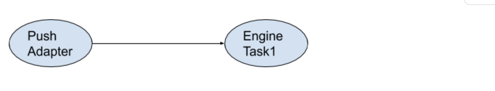

<!-- markdownlint-disable -->

# Engine Developer's Toolkit

Engines allow you to process data such as live camera streams, files or structured data in the Veritone platform.  Data, such as video, can be broken down into parts

The [Veritone Engine Developer's Toolkit](https://github.com/veritone/engine-toolkit/releases/latest) is designed to help you develop [cognitive engines](/developer/engines/cognitive/) that process [segments](/developer/engines/processing-modes/segment-processing/).
For example, images, frames from videos, video clips, and audio files.
If you are building a different kind of engine, you may need to use lower level APIs.

Engines are deployed to the Veritone platform in Docker containers, which can be thought of as being like lightweight virtual machines. The platform will automatically spin up instances of your engine to meet demand.

To deploy an engine into production, you will need to perform the following tasks:

1. [Build your engine executable](#how-to-build-an-engine)
1. [Consume HTTP webhooks to provide integration and respond with appropriate JSON](#webhooks)
1. [Download the Engine Toolkit SDK](#download-the-engine-toolkit-sdk)
1. [Write tests for your code](#testing-your-webhooks)
1. [Write a `Dockerfile` which describes your engine](#writing-a-dockerfile)
1. [Deploy your engine to the Veritone platform](#deploy-to-veritone)

The rest of this guide describes how to do this, and provides additional reading for more advanced use cases.

## How to build an engine

An engine is an executable program, packaged along with its dependencies, into a [Docker container](#writing-a-dockerfile).
Engines listen on an HTTP address and implement [Webhooks](#webhooks), which are called when they receive work.

### Sample engines

To see the code for a complete working engine, go to https://github.com/veritone/V3-Engine-Examples.

> If you would like to contribute an additional example engine, please [open an issue to start a conversation](https://github.com/veritone/engine-toolkit/issues/new?title=sample+project).

## Engine Toolkit

Engine Toolkit (ET) abstracts the input/output layer between the Engine and Veritone platform, freeing engine developers of having to deal with the nuances of getting input data and producing the engine outputs.

1.  Backward compatible -- For chunk engines and other current functionality as described in Veritone docs.

2.  Unified protocol -- The new version of Engine Toolkit strives to provide support to all engine types - keeping the interface consistent so that the choice of implementing chunk, stream, or batch shouldn't be depending on how engines should get their data.

## Engine Interaction with Engine Toolkit

Chunk engines continue to provide the `/process` webhook endpoint. 
The input chunk is provided in the `cacheUri` parameter.  The chunk result can be returned in the response for the `/process` call, or it can be sent asynchronously at a later time. (In the latter case, chunk engines act like stream engines for one chunk.)

Stream engines should also expose the `/process` webhook endpoint. Its input data will also be from `cacheURI`, and produces either [VTN Standard](developer/engines/standards/engine-output/) or other format(s) as task outputs back to ET using the heartbeat/callback endpoint.  Naturally, stream engines will respond almost immediately in handling the `/process` webhook, providing some ACK on the response or other informative response to ET.

Batch engines are similarly invoked and are required to provide heartbeats back to ET for status update with a completion status (per discussion further below). Batch engines can be used to perform their own business logic, and produce the results in a freeform fashion, e.g., producing assets directly to the TDO associated with the job that the task is in. However, they can also produce task outputs for downstream tasks in the job by following the pattern of chunk or stream engines -- producing output results by posting back to ET's `/callback` endpoint. Naturally, this should be set up as part of the job DAG with output of the engine defined in the task routes and I/Os.

## Webhooks

Engines must implement the following webhooks:

* [Ready webhook](#ready-webhook)
* [Process webhook](#process-webhook)

Each webhook provides unique functionality, and is therefore triggered by a unique HTTP request. The requests are described in the following sections.

> The webhook endpoints are configurable and are specified using environment variables in the [`Dockerfile`](#writing-a-dockerfile).

The webhooks are expected to return a `200 OK` successful response, otherwise the engine toolkit will retry the operation by making the same requests again.

### Ready webhook

The Ready webhook is used to determine if the engine is ready to start doing work or not.

```
GET /ready
```

The webhook should reply with a `503 Service Unavailable` status until the engine is ready to receive work, at which point it should reply to this webhook with a simple `200 OK` response.

If the webhook replies with `500` http status, then ET will shutdown.

### Process webhook

The Process webhook is used to perform some processing on a file (like the frame from a video).

```
POST /process
```

The body of the request is a multipart form (Where `Content-Type` is `multipart/form-data`) containing everything the engine needs to do its work.

The following fields will be posted to the Process webhook:

* `internalJobId` - (string) The internal job ID
* `internalTaskId` - (string) The internal task ID
* `chunk` - (File) The file to process (as a path)
* `chunkMimeType` - (string) The MIME type of the chunk (for example, `image/jpg`)
* `startOffsetMS` - (int) The start time of the chunk (for example, the timestamp of when a frame was extracted from a video)
* `endOffsetMS` - (int) The end time of the chunk (see `startOffsetMS`)
* `cacheURI` - (string) - (string) Stream Engines should use this to retrieve the input stream
* `veritoneApiBaseUrl` - (string) URI to aiWARE Core if this edge is connected to a core
* `token` - (string) aiWARE Token to use with aiWARE Core
* `payload` - (string) task payload
* `chunk-metadata-xxxx` - (string) The input chunk may have metadata as intended by the parent task -- which is typically sent by the caller to the parent task. Engine Toolkit will make these available to the engine task with the prefix `chunk-metadata-` and stringified value.
* `inputFolderID` - (string) The ID of the input folder for this chunk

If the engine is a chunk, and the chunk is an image or video:
* `width` - (int) The width of the chunk
* `height` - (int) The height of the chunk

The following advanced fields are also included:
* `cacheURI` - (URI) URL of the chunk source file
* `veritoneApiBaseUrl` - (string) The root URL for Veritone platform API requests
* `token` - (string) The token to use when making low level API requests
* `payload` - (string) JSON string containing the entire task payload

If the engine leverages a library, the following fields will be included:
* `libraryId` - (string) ID of the library related to this task
* `libraryEngineModelId` - (string) ID of the library engine model related to this task
* `libraryModelDirectory` - (string) directory that the engine can use to store library engine models -- either after a training job is done -- or when in matching mode and the engine would like to cache the model for quick access in subsequent tasks.

Filesystem related fields:
* `taskTmpDir` - (string) Temporary directory that serves as a scratchpad for the engine to store temporary data related to the task.  This directory will be purged after a certain time (3 days default).  For any permanent data, use other means.  This directory should already exist when the engine receives its chunk input.
* `engineDir` - (string) directory that the engine can use to store shared assets across different instances

Processing control fields:
* `heartbeatWebhook` - (URI) This is the heartbeat webhook provided by Engine Toolkit.  Engines with async processing for the `/process` webhook, such as stream or batch engines, should submit heartbeats with progress information.  This is the equivalent of stream engines emitting into the engine_status Kafka queue for heartbeats
* `resultWebhook` - (URI) This is the result webhook provided by Engine Toolkit. The engine should submit results of the processing as soon as it could.  This is the equivalent of stream engines emitting into the chunk_all Kafka queue when it finished processing some data off the input stream.
* `externalCallbackWebhook` (URI) Engines may pass this callback URI to an external entity performing the real processing
* `maxTTL` - (int) the maximum  time that engine toolkit can wait for results from the engine.

If `AIWARE_CONTROLLER` environment variable is exposed to the engine, then this will be set:
* `controllerToken` - (string) if `AIWARE_CONTROLLER` is exposed to engine, this will be an edgeToken to use

If the aiWARE cluster includes `Redis` server, then this field is exposed:
* `redisETUrl` - (URI) Only available if REDIS is available for the cluster in which the engine processes its tasks. Engines will not be given direct access to the Redis server, instead engines will GET/POST to Engine Toolkit, which will then call Redis via API for the getting or setting of the keys.

> As the Engine Toolkit evolves, we expect to add more fields here. If you notice something missing, please [open an issue and let us know](https://github.com/veritone/engine-toolkit/issues/new?title=request+fields).

An example request,
```json

```
<!-- TODO: @qdang can you add an example here? -->

#### Chunk Metadata

As mentioned above, input chunk metadata can be made available to the
engine as part of the fields for the `/process` webhook.  The names
for the metadata fields are prefixed with `chunk-metadata-` to
minimize name collision with other data.

The values will be strings. Therefore the engine should perform type
conversion as needed.

#### Process webhook response

The handler for the Process webhook should return the results by writing a JSON response in VTN Standard if applicable.  If the engine returns content in different format such as ttml for transcripts, then engine must set the mime type and send the response

> Most languages and frameworks have very easy ways of consuming HTTP endpoints and writing JSON responses. It is recommended that you use existing libraries where possible.

If the engine cannot return the result synchronously (in the same HTTP request as a response), then the engine must return a JSON payload as defined below:
* `estimatedProcessingTimeInSeconds` - (int) Amount of seconds that the engine  estimates to produce some results. 

Suggested value for `estimatedProcessingTimeInSeconds` is `maxTTL` - or more if maxTTL is insufficient.  For example, if the engine is to call out to external entity for processing and thus may require more than hours to process.

At that point the engine should use the supplied `heartbeatWebhook` and `resultWebhook` endpoints.

##### Example webhook response: Faces

The following JSON is an example showing some faces that were found in the image.

```json
{
	"series": [{
		"startTimeMs": 1000,
		"stopTimeMs": 2000,
		"object": {
			"type": "face",
			"confidence": 0.95,
			"boundingPoly": [
				{"x":0.3,"y":0.1}, {"x":0.5,"y":0.1},
				{"x":0.5,"y":0.9}, {"x":0.3,"y":0.9}
			]
		}
	}, {
		"startTimeMs": 5000,
		"stopTimeMs": 6000,
		"object": {
			"type": "face",
			"confidence": 0.95,
			"boundingPoly": [
				{"x":0,"y":0}, {"x":1,"y":0},
				{"x":1,"y":1}, {"x":0,"y":1}
			]
		}
	}]
}
```

* `series` - (array) List of items found
* `series[].startTimeMs` - (int) The start time of the chunk
* `series[].stopTimeMs` - (int) The end time of the chunk
* `series[].object` - (object) An object describing what was found
* `series[].object.type` - (string) The type of the object
* `series[].object.confidence` - (number) A number `0-1` of how confident the engine is about this object
* `series[].object.boundingPoly` - (array) Array of points that describe the [region within a larger image](#regions)

> If you have a question about what your engine should output and this documentation doesn't cover it, please [open an issue to start a conversation](https://github.com/veritone/engine-toolkit/issues/new).

#### Ignoring chunks

If your engine is not going to process a chunk, the Process webhook should return a `204 No Content` response.

The Engine Toolkit will report the chunk as ignored.

#### Failed responses

If the chunk cannot be processed, the webhook should return a non-200 response code (e.g. `500`) and 
a meaningful error should be written as the response.

> There is no need to return a JSON body on failures, plain text is fine.

## Engine Toolkit Webhooks

These webhooks provide additional functionality to the engine.

### Heartbeat Webhook
Engines performing the processing asynchronously such as stream or batch engines should submit heartbeats to Engine Toolkit on a regular interval (suggested: once every second).  The webhook URI can be discovered in the `heartbeatWebhook` field of the original `/process` request.

#### Request
The POST request to the `heartbeatWebhook` should have the following data as a JSON payload:
* `status` - (string) Required. Possible values: running, complete, failed
* `bytesRead` - (int64) Optional
* `bytesWritten` - (int64) Optional
* `messagesWritten` - (int64) Optional
* `infoMs` - (string) Optional. informational message about the running status of the engine
* `failureReason` (enum)| Required when status is set to failed.  Possible values:<br/>internal_error<br/>external_error<br/>unknown<br/>url_not_found<br/>url_not_allowed<br/>url_timeout<br/>url_connection_refused<br/>url_error<br/>invalid_data<br/>rate_limited<br/>api_not_allowed<br/>api_authentication_error<br/>api_not_found<br/>api_error<br/>file_write_error<br/>stream_read_error<br/>system_dependency_missing<br/>system_error<br/>heartbeat_timeout<br/>other
* `failureMsg` (string) Optional: supplemental info for `failureReason`

#### Response
Engine Toolkit will return with `204 No Content`

### Result Webhook
Whenever the engine has a complete unit of processed work for the task, it should submit the result back to Engine Toolkit for persistence.  The webhook is given to the engine in the `resultWebhook` field of the /process request.

This is useful in the following scenarios:
* Result takes a long time to process
* Result is non-VTN Standard
* Result requires chunk metadata
* Result requires a specific output folder

#### Request

The POST request to the `resultWebhook` should have the following data as a JSON payload:
* `chunkContext` - (string) Optional. This is the value of the `chunkContext` as passed into the request of the `/process` .  It should be present if the engine is chunk engine
* `startOffsetMs` - (int64)  Optional - offset of the start of the chunk from the beginning of the input stream for which this result was produced | |
* `endOffsetMs` - (int64)  Optional - offset of the end of the chunk from the beginning of the input stream for which this result was produced
* `output` - (JSON) Required - VTN-Standard of the result.  See [documentation](https://docs.veritone.com/#/developer/engines/standards/engine-output/) for engine vtn-standard output format.

If the engine wants control over which `outputFolder` gets the chunk, it should pass in:
* `outputFolderID` - (string) The ID of the output folder to send the chunk.  If this is not specified, all output folders will get the chunk

If the engine wants to specify additional metadata (all metadata on the incoming chunk is copied to output), the following must be added:
* `chunk-metadata-xxx` - (string) xxx will be the key for the metadata with the value specified as a string.

If the engine wants to send binary or non-VTN standard, then the engine must set `multipart` to true and use multi-part uploads.  If more than one file is uploaded, multiple chunks will be created.
* `multipart` - (bool) Optional - default false, set to true to enable chunks sent as multipart


For example:
```pre
POST <http://localhost:1234/result/task1234>

{ 
  "index" : 1,
  "startOffsetMs": 0,
  "endOffsetMs": 1200,
  "output" : {"series": [
    {
      "startTimeMs": 0,
      "stopTimeMs": 300,
      "words": [
        {
          "word": "this"
        }
      ]
    },
    {
      "startTimeMs": 300,
      "stopTimeMs": 500,
      "words": [
        {
          "word": "is"
        }
      ]
    },
    {
      "startTimeMs": 500,
      "stopTimeMs": 800,
      "words": [
        {
          "word": "a"
        }
      ]
    },
    {
      "startTimeMs": 800,
      "stopTimeMs": 1200,
      "words": [
        {
          "word": "sentence"
        }
      ]
    }
  ]}
}
```

## Obtaining the Veritone Engine Toolkit

The Veritone Engine Toolkit is available at [Docker Hub](https://hub.docker.com/r/veritone/aiware-engine-toolkit). You can pull it with `docker pull veritone/aiware-engine-toolkit`. However, our recommendation is that you simply pull it at engine build time by including the following line in your project's Dockerfile:

```pre
FROM veritone/aiware-engine-toolkit as vt-engine-toolkit
```

This will ensure that you always build using the most current version of the Toolkit. 

## Testing your webhooks

Since the [Webhooks](#webhooks) are just HTTP endpoints, you can test them by HTTP requests directly
to your own code.

If you want to manually test the Webhooks, you can access the built-in [Engine Toolkit Test Console](#engine-toolkit-test-console).

### Engine Toolkit Test Console

The Engine Toolkit Test Console is a web based tool that lets you simulate the HTTP
requests that your engine will receive in production.

The following is a preview of the test console running in the browser:


You can upload your own file to process, and use the web form to tune the parameters
that your engine expects to support.

#### Access the Engine Toolkit Test Console

To access the test console, run your Docker container with the `docker run` command. Set the environment variable `VERITONE_TESTMODE=true` and expose port 9090 with the `-p 9090:9090` argument:

> `-e "VERITONE_TESTMODE=true" -p 9090:9090`

For example, you might run:

```go
docker build -f Dockerfile -t your-engine .
docker run -e "VERITONE_TESTMODE=true" -p 9090:9090 -p 8080:8080 --name your-engine -t your-engine
```

Once the container is running, you can open a browser at `http://localhost:9090/` to access
the Engine Toolkit Test Console and use it to interact with your engine.

> **Do not** set the `VERITONE_TESTMODE` environment variable in your `Dockerfile` as there is a risk it could be deployed to production in test mode, which will prevent your engine from working.

### Writing a `Dockerfile`

Veritone engines are Docker containers that run in the platform. To provide an engine, you must 
build a Docker container (or image) that can encapsulate your dependencies and execute your code.

A `Dockerfile` explains the steps that Docker needs to take in order to build a container.

The following is an example of an engine `Dockerfile`:

```docker
FROM veritone/aiware-engine-toolkit as vt-engine-toolkit
FROM mhart/alpine-node:14.8

COPY . /app
COPY manifest.json /var/

WORKDIR /app

EXPOSE 8080

RUN apk update \
  && apk upgrade \
  && apk --no-cache add ca-certificates \
  && apk add --no-cache libc6-compat
RUN npm install

ENV VERITONE_WEBHOOK_READY="http://0.0.0.0:8080/readyz"
ENV VERITONE_WEBHOOK_PROCESS="http://0.0.0.0:8080/process"

COPY --from=vt-engine-toolkit /opt/aiware/engine /opt/aiware/engine

RUN ["chmod", "+x", "/app/index.js"]

ENTRYPOINT [ "/opt/aiware/engine", "node", "index.js" ]
```

> See [Create Your Dockerfile](developer/engines/tutorial/engine-tutorial-step-2?id=create-your-dockerfile) for an in-depth explanation of how and why this file is coded the way it is.

The most common commands in a `Dockerfile` are:

* `FROM` describes the Docker container you are starting with
* `RUN` runs a command inside the container (In this case, `apk update && apk --no-cache add ca-certificates` ensures root certificates are installed so that the engine can access secure SSL files. You may or may not need this depending on which base you choose.)
* `ADD` adds files to the container during the build process
* `ENV` sets environment variables
* `ENTRYPOINT` describes the executable that is run when an instance of the container is created by the platform

> To learn more about Docker and what it can do, we recommend that you browse the official [Docker Documentation](https://docs.docker.com/).

> If you want to dig deeper into what can be done in your `Dockerfile`, you can [read the Dockerfile reference manual](https://docs.docker.com/engine/reference/builder/#from) or continue reading for a light overview.

## Engine Toolkit Docker image

Engine Toolkit is available as a Docker image.
To include the Engine Toolkit in your engine Docker, use a [multi-stage build](https://docs.docker.com/develop/develop-images/multistage-build/) process, and copy the toolkit binary to a specific location in your image. Below is a sample Dockerfile snippet showing how the multistage build process is designed to work (notice the multiple FROM statements):

```pre

FROM veritone/aiware-engine-toolkit as vt-engine-toolkit

FROM YOUROWN_DOCKER_IMAGE

COPY --from=vt-engine-toolkit /opt/aiware/engine /opt/aiware/engine

ENTRYPOINT ["/opt/aiware/engine", "YOUR_ENGINE_BINARY"]

```

NOTES:

1. Refreshing the Engine Toolkit:  Make sure the docker image is refreshed by doing a `docker pull veritone/aiware-engine-toolkit` prior to your `docker build`. For a local aiWARE environment, it is best to pull before building (`docker pull veritone/aiware-engine-toolkit`).
  
2. Using Engine Toolkit in an Alpine-based image:  To use Engine Toolkit with an alpine image, make sure to include this in the Dockerfile:

`RUN apk add --no-cache libc6-compat`

3. It is important to specify `/opt/aiware/engine` as the toolkit-binary location. Doing so will ensure that the most up-to-date binary is automatically used.

#### Understand the `Dockerfile`

The `Dockerfile` above describes a simple but complete engine. This section explains the components that make up an engine.

##### Manifest file

```docker
ADD manifest.json /var/manifest.json
```

The `manifest.json` file is a JSON configuration file the describes details about your engine, such as its `engineId`, which file-types it supports, what kind of data it outputs, and more.

> The platform will [automatically generate your manifest file](#automatically-generate-your-manifest-file).

Usually your `manifest.json` file sits alongside your `Dockerfile` in your engine project folder.

##### The `engine` executable

```docker
ADD ./dist/engine /app/engine
```

The `engine` executable gets added to your docker image as the entry point, and it acts as a proxy between the Veritone platform and your webhooks.

Specifically, it:

* Starts your engine process proxying the stdout and stderr
* Connects to the Veritone platform and receives work
* Calls your webhooks
* Writes your responses back to the platform

It is available when you [download the Engine Toolkit SDK](#download-the-engine-toolkit-sdk).

##### Environment Variables

```docker
ENV VERITONE_WEBHOOK_READY="http://0.0.0.0:8888/readyz"
ENV VERITONE_WEBHOOK_PROCESS="http://0.0.0.0:8888/process"
```

The environment variables specified with the `ENV` command inform the `engine` tool which webhooks to hit.

* `VERITONE_WEBHOOK_READY` - (string) Complete URL (usually local) of your Ready webhook
* `VERITONE_WEBHOOK_PROCESS` - (string) Complete URL (usually local) of your Process webhook
* `AIWARE_ENV_WHITE_LIST` - (string)  Comma separated list with environment variable names that will be passed onto the engine from the engine toolkit

Engine Toolkit will pass on all environment variables defined when the
engine instance is started to the engine’s process with the exception of
`AIWARE_` -prefixed environment variables.

For example, the following Dockerfile snippet sets AIWARE\_ENV\_WHITE\_LIST  so
that the environment variables, AIWARE\_BUILD\_ID,AIWARE\_xyz, can be
passed on to the engine process:

```
ENV AIWARE\_ENV\_WHITE\_LIST AIWARE\_BUILD\_ID,AIWARE\_xyz
```

> NOTE: AIWARE\_CONTROLLER is automatically added to the white list.

##### Engine entrypoint

```docker
ENTRYPOINT [ "/app/engine", "/app/your-engine", "--your-arg-1", "--your-arg-2" ]
```

The `ENTRYPOINT` must always be the [`engine` executable](#the-engine-executable) as the first argument, but the other arguments are for you to use to specify your engine code process.

* `/app/engine` - (required constant string) Must be `/app/engine` since it refers to the [`engine` executable](#the-engine-executable)
* `/app/your-engine` - (required string) The path and name of your custom engine executable
* `--your-arg-n` - (optional strings) Additional arguments to pass when running your custom engine executable

## Deploy to Veritone

To deploy your code in Veritone, you must first create an engine on the platform.

> This process is trivial and easy to clean up, so don't worry about getting the forms exactly right the very first time. This guide will call out any important fields.

1. Go to [https://developer.veritone.com/](https://developer.veritone.com/) and sign in
1. Click on <strong>ENGINES</strong> in the navigation
1. Click <strong>NEW</strong> and select <strong>ENGINE</strong> from the menu to create a new engine
1. Select <strong>Cognition</strong> engine type
1. Complete the form selecting the appropriate or closest match options from the <strong>Engine Category</strong>
1. Only check <strong>Library Required</strong> if your engine code knows how to interact with the Veritone Library via the GraphQL API
1. Click <strong>Next</strong>
1. Select your deployment model that describes your engine's needs
1. Click <strong>Next</strong>&mdash;you may skip the <strong>Custom Fields</strong> page if this is the first time creating an engine
1. Click <strong>Submit</strong>

Your engine will be created and you'll be redirected to its console page.

### Automatically generate your manifest file

In the in-app documentation of your [engine's console page](https://developer.veritone.com), click <strong>GENERATE MANIFEST FILE</strong> to have the platform generate your [manifest.json file](#manifest-file).

The rest of the in-app documentation explains how to authenticate the Docker tools and use them to tag and push your engine.

## Notifications
When an engine finishes processing a chunk successfully, if its task
was created with the `sendOutputToUris` option, Engine Toolkit will post the result to that URI following this pattern:

```
POST
{uri}/internalJobID={internalJobID}&internalTaskID={internalTaskID}&jobID={jobID}&taskID={taskID}&chunkID={chunkID}&timestamp={timestamp
when chunk is produced}
```

In addition, if there are metadata that were produced by a parent task
that started with `x-aiware-`,  those metadata will be sent on as
custom headers for the POST request.

For example, a job has the following tasks, with Engine Task 1 having a
notification URI associated with its task:



A caller can `push` a chunk to the `push adapter` to make the chunk
available to Engine Task 1 almost immediately. The push adapter will
store the request Headers as part of the chunk metadata.  This chunk
metadata can then be passed to the engine `/process` webhook and the
notification servers as configured by the caller.

A use case for this pattern is to measure the roundtrip from the time
the chunk was sent to push adapter task, to the time that EngineTask 1
finishes processing the chunk. In this situation:

1.  A Notification server is established
2.  The caller creates a job, using the controller CreateJob API,
    passing on the uri of the notification server to the task
3.  When the caller pushes a chunkt to the Push Adapter via HTTP, it
    should also send a Header, `x-aiware-chunk-timestamp` =  the epoch
    time of the current time.
4.  Assuming, that the engine is aware of this header, for example to
    calculate the elapsed time between the caller sending the chunk and
    the time that the engine receives the data, in the engine’s  handler
    for the `/process` webhook, it can retrieve the
    `chunk-metadata-x-aiware-chunk-timestamp` from the request
    parameters and perform the calculation
5.  When the engine posted the engine output back to Engine Toolkit,
    either synchronously as returned from `/process` or asynchronously
    to the `resultWebhook`, Engine Toolkit will send the same output
    to the notification server, with the same header,
    `x-aiware-chunk-timestamp`, and the same value as posted initially
    by the caller.
6.  The notification server retrieves the `x-aiware-chunk-timestamp`
    header and performs the calculation for the total round trip -- from
    start to finish.

## Library Support

### Training libraries

An engine can be started in a job with `mode=library-train` in the
task payload. Follows is a sample of mutation to create such job:

```graphql
mutation createTrainingJob{
  createJob(input:{
    clusterId :"____YOUR_CLUSTER_ID____________"
    tasks:[
      {
        engineId:"__ENGINE_ID__",
        payload:{
          mode:"library-train"
          libraryId:"33e7c3fd-dc76-45ca-915e-49a18fe14546"
          libraryEngineModelId:"e0fafd01-03db-4d6b-b651-526b4320b2b5"
        }
      }
    ]
  }) {
    id
    tasks{
      records{
        engineId
        payload
      }
    }
  }
}
```

Details of training are private to the engine. It is up to the engine
to know how to capture the state information that it considers "training,"
and store that captured state info in a library engine model using the Veritone
GraphQL API. (Veritone provides the state-persistence API, but puts no restrictions on
how an engine accomplishes, or formats, its "training." Your library engine model can contain whatever private data
the engine might need when it is called upon, in the future, to recall its "training." The format of the data
is up to you.)

In V3F, an engine -- be it chunk, stream, or batch, training mode or not
-- will be invoked in the same way, e.g via the `/process` webhook, with
data pertaining to its task. The engine should examine the payload
field of the request for the `mode`.  Training libraries can take a while to run,
and thus, in training mode, the engine behaves as a batch engine, which means it
should respond to `/process` as soon as possible, and post back to the
`/heartbeat` webhook periodically (once per second) so the Engine Toolkit can monitor progress.
When training is finished and the library engine model is updated, the
engine can then post to `/heartbeat` webhook with a `"complete"` status.

Besides uploading the final trained engine model to S3 or wherever
persistence storage is, the engine may store the model in the directory
created by Engine Toolkit and given to the engine as the value of the
field `libraryModelDirectory`. This is to optimize the loading of the
library model and is not a replacement for cloud storage; the library engine model
should be persisted back to Veritone core using the GraphQL API.
See the [Training](developer/libraries/training) discussion for information on how to persist training data programmatically.

### Consuming Training Libraries

In normal processing, the engine will be given a library model's
libraryId and libraryEngineModelId in the payload field.  Also,
`mode=library-run` will be present in the `payload` field.

Since loading a library engine model can be time-consuming, the engine
should cache library engine models using the `libraryModelDirectory`
parameter that the Engine Toolkit has created and made available to the
engine in the request POSTed to the engine’s `/process` webhook.  This
location can store `libraryEngineModels` for use across chunk processing
of a task or even across different tasks.

When using this pattern, the library engine model data goes into directories
using the following naming scheme:

`/cache/{shard}/libraries/{libraryId}/{libraryEngineModelId}`

This is the recommended patter:

1.  Engine gets the `libraryEngineModelId` from the `payload` field.
2.  Check the cache directory indicated by the `libraryModelDirectory` for
    the library model engine (see above). If it is not there, the library
    engine model is not yet downloaded. Thus the engine could download
    the library engine model to that directory.
3.  Once the library engine model is downloaded to the local file, it is
    then available to that engine instance as well as other future
    engine instances that were passed the same `libraryId` and library
    engine model id.

> As it is possible that multiple engine instances may be using the same
model at the same time, the engine developer should be prepared to
devise a scheme to avoid corrupting the model.

## Redis

An engine may want to share states as chunks being processed for a task
or job. Engine Toolkit provides limited access to Redis for this. _Note that if
the cluster does not have a Redis server set up and made accessible from
within the Docker container running the engine, this feature will not be
available._

Engine Toolkit looks for the presence of AIWARE\_REDIS\_HOST,
AIWARE\_REDIS\_PORT before it starts the local redisET server. It will
pass the url to this local server to the engine `/process` webhook via the
form field `redisETUrl`,

e.g

`redisETUrl = http://localhost:xxx`

The engine can only GET or POST within the context that was given to the
`/process` endpoint.

For job -- the `internalJobId` should only be the same `internalJobId` as
passed to the `/process` webhook.

```
GET /keys/j{internalJobId}/{key}

POST /keys/j{internalJobId}/{key}
```

Similarly, for tasks, the `internalTaskId` should only be the same
`internalTaskId` as passed to the `/process` webhook.

```
GET /keys/t{internalTaskId}/{key}

POST /keys/t{internalTaskId}/{key}
```

> A key value will have a TTL in Redis cache. The default value is 24
hours. If the engine wants to have a different TTL for the key, it can
pass on to the POST request with the query string ttlInSeconds.

For example:

```
POST /keys/t{internalTaskId}/{key}?ttlInSeconds=3600

Potential HTTP response code:

200 - for GET requests - the contents of the key as POSTed previously
and key is not yet expired

200 - for POST request - empty body (should it be 204?)

404 - for GET requests with invalid keys or expired ttl, or GET/POST
request outside of the allowed internalTaskId, internalJobId

400 - for bad requests such as missing body

500 - for other internal server error - e.g. Redis issue
```

## Development guides

This section includes some helpful guides for how to solve common problems when building engines.

### Converting V2F Engines to V3

Converting an Engine-Toolkit based V2 Engine to V3 is pretty straight forward.  Converting a non-Engine-Toolkit based engine will require implementing Engine Toolkit APIs.

For chunk Engines that already use the Engine Toolkit (and thus do not have any direct interaction with Kafka), conversion to V3F is an easy process. Just pick up the latest distribution of the Engine Toolkit. (Follow the best practices described below when you create your Dockerfile.)

Stream Engines need to be updated to move away from consuming directly from Kafka. Think of a stream engine as a chunk engine processing just a single chunk. The payload would come from the `payload` field in the post request to the `/process` webhook (vs. PAYLOAD_JSON env variable in V2F). Pay heed to the Heartbeat Webhook and Result Webhook discussions further below. If your engine takes more than one second to process a unit of work, plan on sending one heartbeat per second to the `heartbeatWebhook`.

From V2F | Converting to V3F
-- | --
Upon start up, read PAYLOAD_JSON for job info | Need to expose 2 webhooks :  `/readyz` and `/process` - set environment variables accordingly ([See documentation](https://docs.veritone.com/#/developer/engines/toolkit/?id=webhook-environment-variables)). Job information is in the `payload` field of the `/process` request.
Read input stream from Kafka | Read input stream from the `cacheURI` which is set in the POST request to /process webhook
Output results to Kafka | Post the result to the resultWebhook of Engine Toolkit.  See [Result Webhook (from Engine Toolkit)](overview/aiWARE-in-depth/engines?id=result-webhook-from-engine-toolkit)
Heartbeat to Kafka | Post heartbeat message to the heartbeatWebhook of Engine Toolkit.  See [Heartbeat Webhook (from EngineToolkit)](overview/aiWARE-in-depth/engines?id=heartbeat-webhook-from-enginetoolkit)

Batch Engines should provide the `/process` webhook, similarly to stream engines. The payload to the engine is available in the request to the webhook.  The batch engine SHOULD NOT update task status or output directly. Heartbeats should be provided by posting back to the `/callback` endpoint from ET

From V2F | Converting to V3F
-- | --
Upon start up, read PAYLOAD_JSON for job info | Need to provide 2 webhooks :  `/readyz` and `/process` - set environment variables accordingly ([See documentation](https://docs.veritone.com/#/developer/engines/toolkit/?id=webhook-environment-variables)).  Job information is in the `payload` field of the /process request
Update Task Status to `running` or `complete` | Do not update task status back to core.  Instead submit heartbeat message to the `heartbeatWebhook` of Engine Toolkit.  See [Heartbeat Webhook (from EngineToolkit)](overview/aiWARE-in-depth/engines?id=heartbeat-webhook-from-enginetoolkit)

### Regions

To specify a region (such as an area on an image) the Veritone platform expects a relative array of `x,y` points where each value is between `0` and `1`, with `0` being the left or top of an image and `1` being the right or bottom.

Relative (or ratio) values are used so that they remain correct regardless of the resolution of the image.

```metadata json
"boundingPoly": [
	{"x": 0, "y": 0},
	{"x": 1, "y": 0},
	{"x": 1, "y": 1},
	{"x": 0, "y": 1}
]
```

> This example essentially draws a box around the entire image.

The following diagram represents the points for a box describing an object that is `50x50` in the center of a `100x100` image:


The `boundingPoly` array for this object would be:

```metadata json
"boundingPoly": [
	{"x": 0.25, "y": 0.25},
	{"x": 0.75, "y": 0.25},
	{"x": 0.75, "y": 0.75},
	{"x": 0.25, "y": 0.75}
]
```

#### Calculating the ratio value

To calculate the `x` and `y` ratio values, you divide `x` by the width and `y` by the height:

```
ratioX = x / width
ratioY = y / height
```

## Troubleshooting

This section provides answers to common problems that have been reported by
engine developers.

### `x509: certificate signed by unknown authority`

If you see an error complaining about an unknown authority, it's likely that you do not have
root certificates installed inside your Docker container.

Try adding the following line to your `Dockerfile`:

```docker
RUN apk --no-cache add ca-certificates
```

This will install the certificates as part of your Docker build.

> This solution has only been tested when the base Docker image is `FROM alpine:latest`. For other base images, you might need to install them with a different command.
